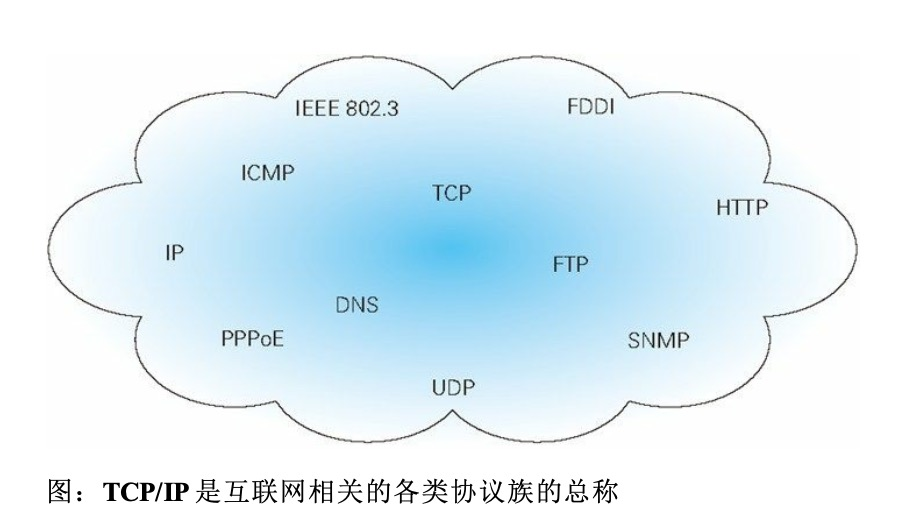
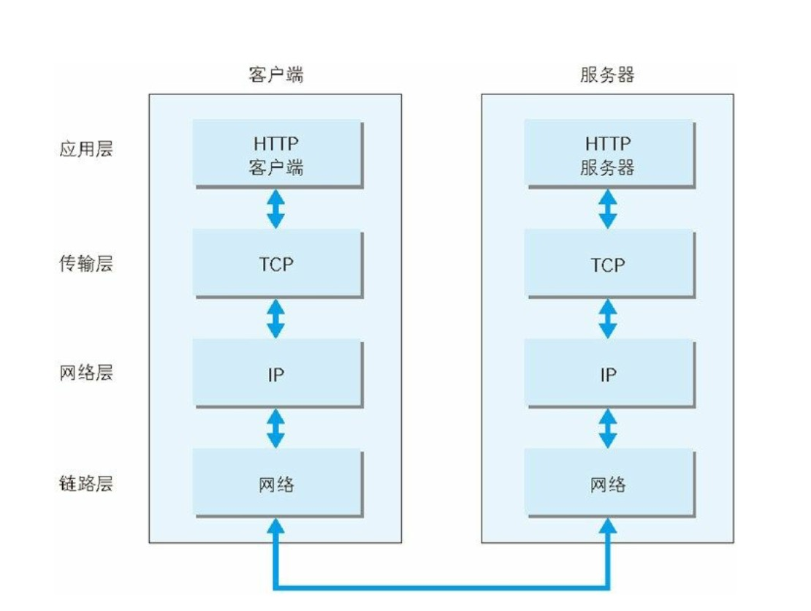
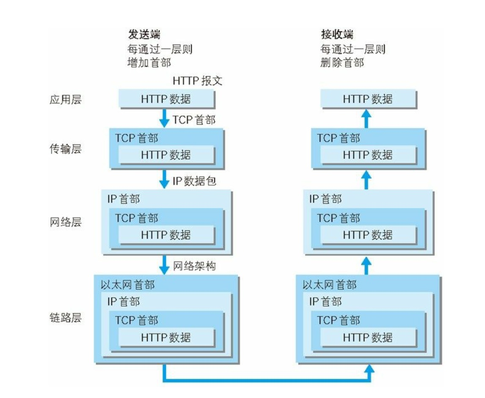
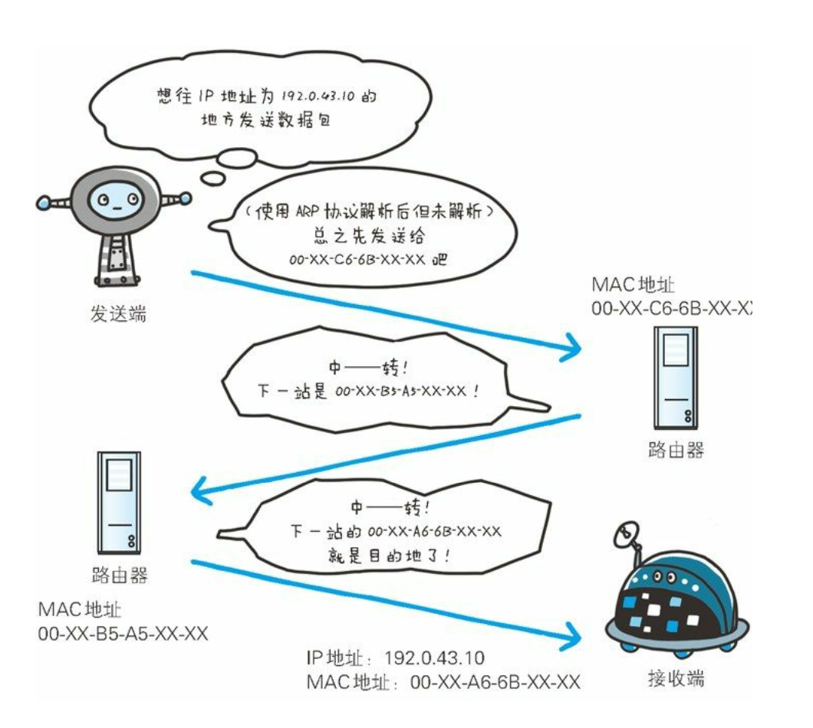
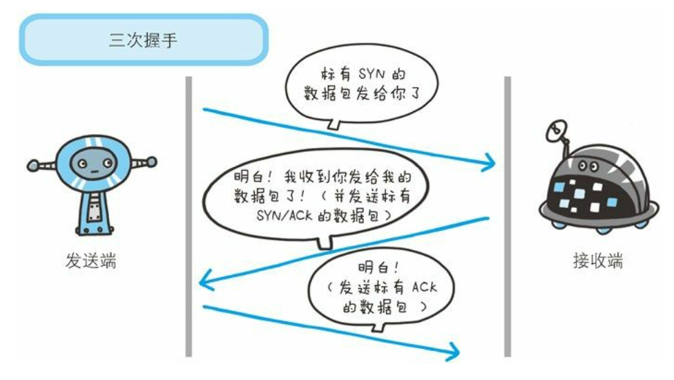
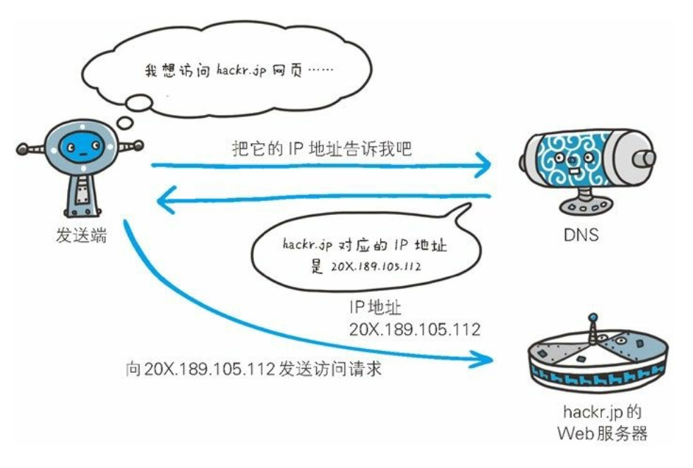
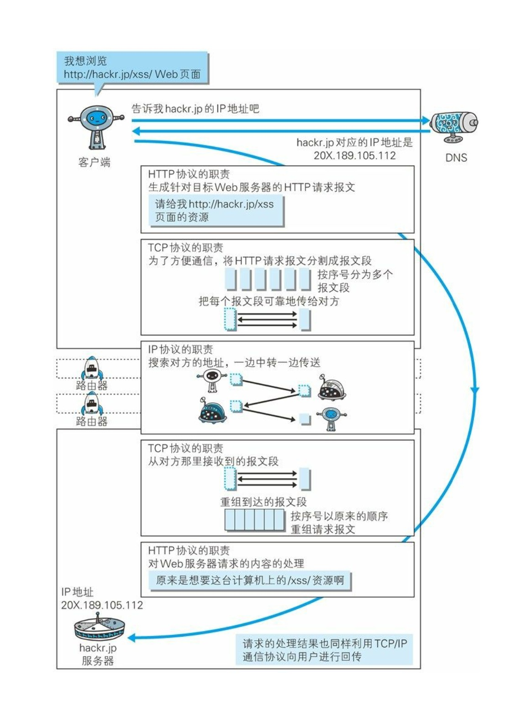
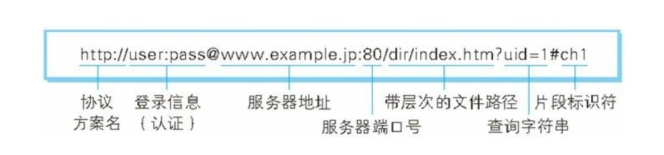

Web使用一种名为HTTP(HyperText Transfer Protocol , 超文本传输协议)的协议作为规范，完成从客户端到服务端等一系列运作流程。而协议是指规则的约定。可以说，Web是建立在HTTP协议上的通信。

CERN（欧洲核子研究组织）的蒂姆·伯纳斯-李 博士提出了一种能让远隔两地的研究者们共享知识的设想

最初设想的基本理念是：借助多文档之间互相关联形成的超文本（HyperText）。连成可以互相参阅的WWW（World Wide Web，万维网）；

现在已经提出了3项WWW构建技术，分别是：

* 把SGML（Standard Generalized Markup Language，标准通用标记语言）作为页面的文本标记语言的HTML（HyperText Markup Language，超文本标记语言）；
* 作为文档传递协议的HTTP；
* 指定文档所在地址的URL（Uniform Resource Locator，统一资源定位符）；

>  HTTP 协议的出现主要是为了解决文本传输的难题。

#### 1.3网络基础TCP/IP

通常使用的网络（包括互联网）是在TCP/IP协议族的基础上运作的，而HTTP属于它内部的一个子集

##### TCP/IP协议族

计算机与网络设备要互相通信，双方就必须基于相同的方法。比如，如何探测到通信目标、由那一边先发起通信、使用哪种语言进行通信、怎样结束通信等规则都需要事先确定。不同硬件、操作系统之间的通信，所有的这一切都需要一种规则。而我们把这种规则称为**协议（protocol）**

协议中存在各式各样的内容。从电缆的规格到IP地址的选定方法、寻找异地用户的方法、双方建立通讯的顺序，以及web页面显示需要处理的步骤，等等。

把互联网相关联的协议集合起来总称为TCP/IP

#####TCP/IP的分层管理

TCP/IP协议族里重要的一点就是分层。TCP/IP协议族按层次分别分为4层：

1. 应用层

   应用层决定了向用户提供应用服务时通信的活动

   TCP/IP协议族内预存了各类通用的应用服务。比如，FTP（File Transfer Protocol，文件传输协议）和DNS（Domain Name System，域名系统）服务就是其中两类。

   HTTP协议也处于该层

2. 传输层

   传输层对上层应用层，提供处于网络连接中的两台计算机之间的数据传输。

   在传输层有两个性质不同的协议：TCP（Transmission Control Protocol，传输控制协议）和UDP（User Data Prototcol，用户数据报协议）。

3. 网络层

   网络层用来处理在网络上流动的数据包。数据包是网络传输的最小数据单位。该层规定了通过怎样的路径（所谓的传输路线）达到对方计算机，并把数据包传送给对方。

   与对方计算机之间通过多台计算机或网络设备进行传输时，网络层所起的作用就是在众多的选项内选择一条传输路线。

4. 数据链路层（又名链路层，网络接口层）

   用来处理链接网络的硬件部分，包括控制操作系统，硬件的设备驱动，NIC（Network Interface Card，网络适配器，即网卡），及光纤等无力可见的部分（还包括连接器等一切传输媒介）。硬件上的范畴均在链路层的作用范围之内

##### 1.3.3  TCP/IP通信传输流

利用TCP/IP协议族进行网络通信时，会通过分层顺序与对方进行通信。发送端从应用层往下走，接收端则往应用层往上走。

我们用HTTP举例来说明，首先作为发送端的客户端在应用层（HTTP协议）发送一个想看某个Web页面的HTTP请求。

接着，为了传输方便，在**传输层（TCP协议）**把从**应用层**处收到的数据（HTTP请求报文）进行分割，并在各个报文上打上标记序号及端口号后转发给**网络层**

在**网络层（IP协议）**，增加作为通信目的地的MAN地址后转发给**链路层**。这样一来，发往网络的通信请求就准备齐全了。

接收端的服务器在**链路层**接收到数据，按序往上层发送，一直到**应用层**。当传到**应用层**，才能算真正接收道由客户端发送来的HTTP请求

发送端在层与层之间传输数据是，每经过一层时必会被打上一个该层所属的首部信息。反之，接收端在层与层传输数据时，每经过一层时会把对应的首部消去。

这种吧数据信息包装起来的做法称为封装（encapsulate）

#### 1.4 与HTTP关系密切的协议：IP、TCP、和DNS

##### 1.4.1 负责传输的IP协议

> MAC 地址(Media access control address)是分配给网络接口控制器(Network interface controller, NIC)的唯一标识符，它会在网络段中充当网络地址使用。

按层次分，**IP（Internet Protocol）国际协议位于网络层**。几乎所有使用网络的系统都会用到这个IP协议。TCP/IP协议族中的**IP**指的就是**国际协议**，

IP协议的作用时把各种数据包传送给对方。而要保证确实传送到对方那里，则需要满足两个重要条件：**IP地址**和**MAC地址（Media Access Control Address）**。

**IP地址**指明了节点被分配到的地址，**MAC地址**指的是网卡所属的固定地址。**IP地址**可以和**MAC地址**进行配对。**IP地址**可变换，但**MAC地址**基本上不会更改。

使用**ARP协议**凭借**MAC地址**进行通信

IP 间的通信依赖MAC地址。在网络上，通信的双方在同一网（LAN）内的情况是很少的，通常是经过多台计算机和网络设备中转才能连接到对方。而在进行中转时，会利用下一站中转设备的MAC地址来搜索下一个中转目标。这时，会采用ARP协议（Address Resolution Protocol）。

> ARP是一种用以解析地址的协议，根据通信方的IP地址就可以反查处对应的MAC地址

在到达通信目标前的中转过程中，那些计算机和路由器等网络设备只能获悉很粗略的传输路线。这种机制称为**路由选择（routing）**。

##### 1.4.2确保可靠性的TCP协议

按层次分，TCP位于传输层，提供可靠的字节流服务。

所谓的字节流服务（Byte Stream Service）是指，为了方便传输，将大块数据分割成以文段（segment）为单位的数据包进行管理。而可靠的传输服务是指，能够吧数据准确可靠地传递给对方。

TCP协议为了更容易传送大数据才把数据分割，而且TCP协议能够确认数据最终是否送达到对方。

为了准确无误地将数据送达目标处，TCP协议采用了三次握手（three-way handshaking）策略 。 用TCP协议把数据包送出去后，TCP不会对传送后的情况置之不理，它一定会向对方确认是否成功送达。

握手过程中使用了TCP的标志（flag）———SYN（synchronize）和ACK（acknowledgement）。

发送端首先发送一个带SYN标志的数据包给对方。接受端收到后，回传一个带有SYN/ACK标志的数据包以示传达确认信息。最后，发送端在回传一个带ACK标志的数据包，代表“握手”结束。

若在握手过程中某个阶段莫名中断，TCP协议会再次以相同的顺序发送相同的数据包。

> 除了上述三次握手，TCP 协议还有其他各种手段来保证通信的可靠 性。

#### 1.5负责域名解析的DNS服务

DNS（Domain Name System）服务是和HTTP协议一样位于应用层的协议。它提供域名到IP地址之间的解析服务。

>  计算机既可以被赋予IP地址，也可以被赋予主机名和域名

DNS协议提供通过域名查找IP地址，或逆向从IP地址反查域名的服务。

#### 1.6各种协议与HTTP协议的关系

#### 1.7 URI和URL

与**URI**（统一资源标识符）相比，我们更熟悉**URL**（Uniform Resource Locator，统一资源定位符）。URL正是使用Web浏览器等访问Web页面时需要输入的网页地址。

##### 1.7.1统一资源标识符

**URI**是Uniform Resource Identifier 的缩写。

​		RFC2396分别对这3个单词进行了如下定义

**Uniform**

> ​	规定统一的格式可方便处理多种不同类型的资源，而不根据上下文环境来识别资源指定的访问方式。另外，加入新增的协议方案（如：http：或ftp：）也更容易

**Resource**

>资源的定义是“可标识的任何东西”。除了文档文件，图像或服务器等能够区别于其他类型的，全都可以作为资源。另外，资源不仅可以是单一的，也可以是多数的集合体

**Identifier**

表示可标示的对象，也称为标识符

**综上所述，URI就是由某个协议方案表示的资源的定位标示符。协议方案是指访问资源所使用的协议类型名称。**

> 标准的URI协议方案由30种左右，由隶属于国际互联网资源管理的非营利社团**ICANN**（Internet Corporation for Assigned Names and Nuumbers，互联网名称与数字地址分配机构）的**IANA**（Internet Assigned Numbers Authority，互联网号码分配局）管理分配。

URI用字符串标识某一互联网资源，而URL表示资源的弟弟单，可见URL是URI的子集

##### 1.7.2URI格式

表示指定的URI，要使用涵盖全部必要信息的绝对URI、绝对URL以及相对URL。

> 相对URL，是指从浏览器中基本URI处指定的URL，形如/image/logo.gif

绝对URI的格式

使用http: 或 https: 等协议方案名获取访问资源时要指定协议类型。

也可以使用data: 或 javascript: 这类指定数据或脚本程序的方案名

* 登录信息(认证)

  指定用户名和密码作为从服务器端获取资源时必要的登录信息(身份 认证)。此项是可选项。

* 服务器地址

  使用绝对URI必须指定待访问的服务器地址。地址可以是类似 baidu.com 这种的DNS 可解析的名称，或是 192.168.1.1 这类 IPv4地址名，还可以是 [0:0:0:0:0:0:0:1] 这样用方括号括起来的IPv6地址名

* 服务器端口号

  指定服务器连接的网络端口号。此项也是可选项，若用户省略则自动使用默认端口号

* 带层次的文件路径

  指定服务器上的文件路径来定位特指的资源。这与UNIX系统的文件目录结构相似

* 查询字符串

  针对已指定的文件路径内的资源，可以使用查询字符串传入任意参数。

* 片段标示符

  使用片段标示符通常可以标记出已获取资源中的子资源（文档中的某个位置）。到那时在RFC中并没有明确规定其使用方法。该项也为可选项

> 并不是所有应用程序都符合RFC
>
> 有一些用来指定HTTP协议技术标准的文档，它们被称为   RFC（Request for Comments，征求修正意见书）

