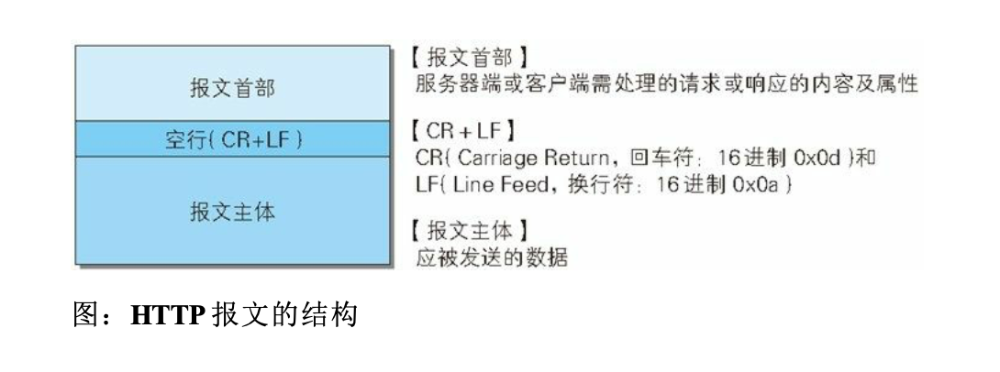
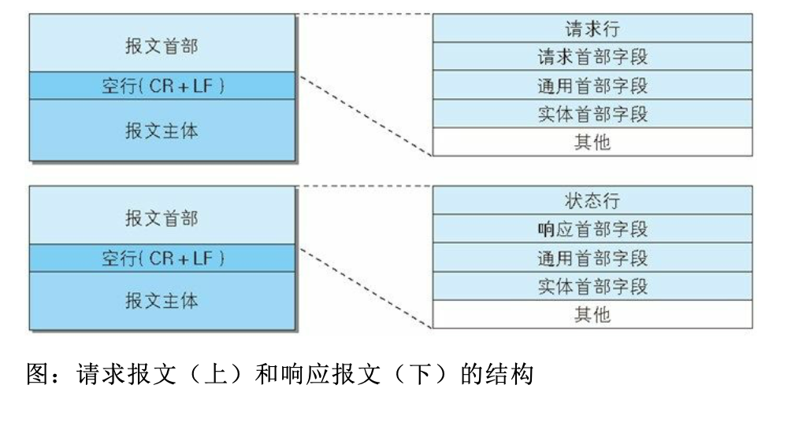
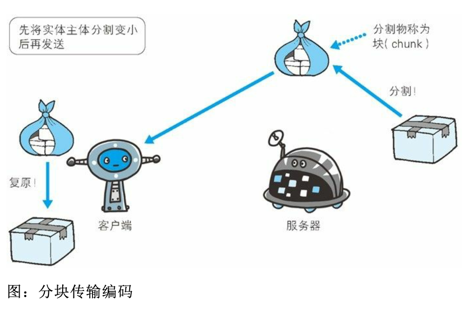
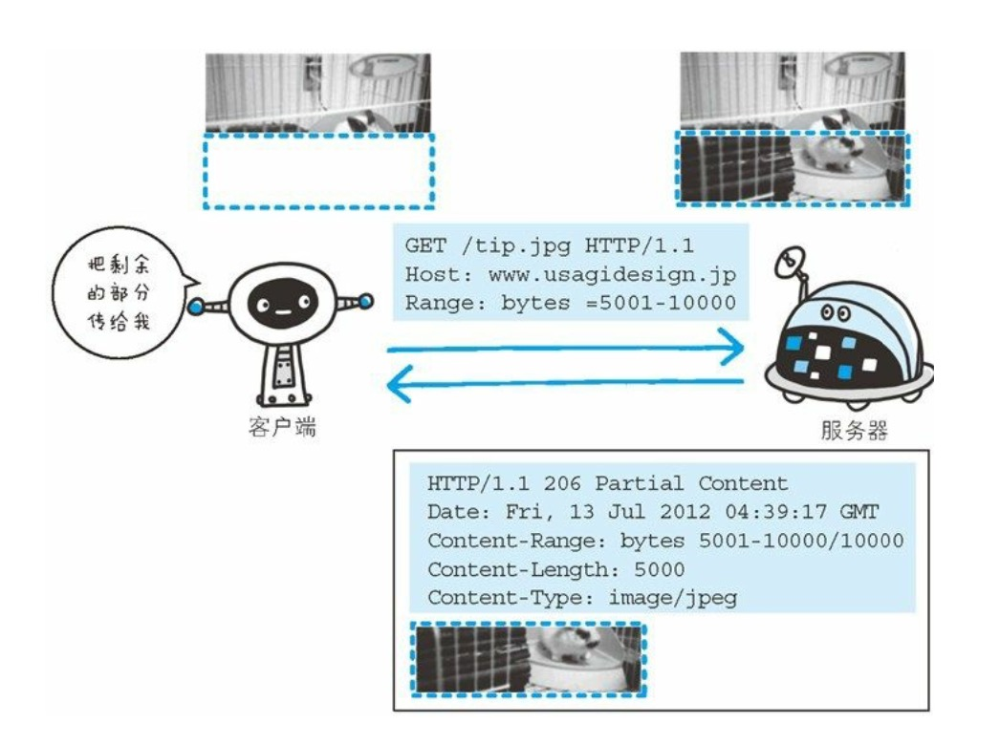

### 3.1HTTP报文

用于HTTP协议交互的信息被称为HTTP报文。请求端（客户端）的HTTP报文叫做请求报文，响应端（服务器端）的叫做响应报文。

HTTP 报文本身是由多行(用 CR+LF 作换行符)数据构成的字符串文 本。



###3.2请求报文及响应报文的结构



* 请求行

  包含用于请求的方法，请求URI和HTTP版本

* 状态行

  包含表明响应结果的状态码，原因短语和HTTP版本

* 首部字段

  包含表示请求和响应的各种条件和属性的各类首部。

  一般有4种首部，分别是：通用首部、请求首部、响应首部和实体首部。

* 其他

  可能包含HTTP的REC里未定义的首部（Cookie等）。

### 3.3编码提升传输速率

HTTP在传输数据时可以按照数据原貌直接传输，但也可以在传输过程中通过编码提升传输速率。通过在传输时编码，能有效地处理大量的访问请求。但是，编码的操作需要计算机来完成，因此会消耗更多的CPU等资源。

#### 3.3.1 报文主体和实体主体的差异

* 报文（message）

  是HTTP通信中的基本单位，由8位组字节流（octet sequence，其中octet为8个比特）组成，通过HTTP通信传输

* 实体（entity）

  作为请求或响应的有效载荷数据（补充项）被传输，其内容由实体首部和实体主体组成。

HTTP报文的主体用于传输请求回响应的实体主体


#### 3.3.2 压缩传输的内容编码

HTTP协议中有一种被称为内容编码的功能可以实现类似压缩文件的操作


常用的内容编码有以下几种：

* **gzip（GUN zip）** , 'Accept-Encoding': 'gzip,deflate' 
* **compress (UNIX 系统的标准压缩）**
* **deflate （zlib）**
* **identity（不进行编码）**

#### 3.3.3 分割发送的分块传输编码

在HTTP通信过程中，请求的编码实体资源尚未全部传输完成之前，

浏览器无法显示请求页面。在传输大容量数据时，通过吧数据分割成多块，能够让浏览器逐步显示页面。

这种把实体主体分块的功能称为分块传输编码（Chunked Transfer Coding）。



分块传输编码回将实体主体分成多个部分（块）。每一块都会用十六进制来标记块的大小，而实体主体的最后一块会使用“0(CR+LF)”来标记。

使用分块传输编码的实体主体会由接收的客户端负责解码，恢复到编码前的实体主体

HTTP/1.1中存在一种称为传输编码（Transfer Coding） 的机制，它可以在通信时按某种编码方式传输，但是只定义作用于分块传输编码中

###3.4发送多种数据的多部分对象合集

HTTP协议中采纳了多部分对象合集，发送的一份报文主体内可能含有多类型实体。通常是在图片或文本文件等上传时使用

* **multipart/from-data**

  在Web表单上传文件时使用

* **multipart/byteranges**

  状态码206（Partial Content，部分内容）响应报文包含了多个范围的内容时使用。

* **multipart/form-data**

  ```http
  Content-Type:multipart/form-data;boundary-AaB03x
  
  --AaB03x
  Content-Disposition:form-data;name="field1"
  
  Joe Blow
  --AaB03x
  COntent-Disposition:form-data;name="pics";filename="file1.txt"
  content-Type:text/plain
  
  ...(file1.txt的数据)...
  --AaB03x
  ```

* **multipart/byteranges**

  ```http
  HTTP/1.1 206 Partial Countent
  Date:Fri,13 Jul 2012 02:45:26 GMT
  Last-Modified:Fri,31 Aug 2007 02:02:20 GMT
  Countent-Type:multipart/byteranges;Boundary=THIS_STRING_SEPARATES
  
  
  --THIS_STRING_SEPARATES
  Content-Type:application/pdf
  Content-Range:butes 500-999/8000
  
  
  ...(范围指定的数据)...
  --THIS_STRING_SEPARATES
  Content-Type:application/pdf
  Countent-Range:bytes 7000-7999/8000
  
  ...(范围指定的数据)...
  --THIS_STRING_SEPARATES--
  ```

  在HTTP报文中使用多部分合集时，需要在首部字段里脊上Content-type。

  使用`boundary` 字符串来划分多部分对象集合指明的各类实体。在boundary字符串指定的各个实体的起始行插入“ `-- ` ” 标记（例如：`--AaB03x` 、 `--THIS_STRING_SEPARATES`  ）, 而在多部分对象集合对应的字符串的最后插入    `--`  标记（例如： `--AaB03x `   `--THIS_STRING_SEPARATES--` ） 作为结束。

  多部分对象集合的每个部分类型中，都可以含有首部字段。另外，可以在某个部分中嵌套使用多部分对象集合。

  

  ### 3.5获取部分内容的请求范围

  > 可以用于下载文件时突然中断，做一个可恢复的机制，从之前下载中断处恢复下载
  >
  > 要实现该功能需要指定下载的实体范围。像这样，指定范围发送的请求叫做范围请求（Range Request）

  

  例子：

  

  

执行范围请求时，会用到首部字段Range 来指定资源的byte范围

byte范围的指定形式如下。

* **5001～10000**字节

  ```http
  Range:bytes=5001-10000
  ```

* **从5001**字节之后的全部

  ```http
  Range:bytes=5001-
  ```

* 从一开始到**3000**字节和**5000～7000**字节的多重范围

  ```http
  Range:bytes=-3000,5000-7000
  ```

针对范围请求，响应会返回状态码为206 Partial Content 的响应报文。另外，对于多重范围请求，响应会在首部字段Content-Type标明  multipart/byterabges 后返回响应报文

如果服务器端无法响应范围请求，则会返回状态码200 OK 和完整的实体内容


### 3.6内容协商返回最合适的内容

同一个Web网站有可能存在着多份相同内容的页面。比如英语版和中文版的Web页面，当浏览器的默认语言为英语或中文，访问相同 URI 的 Web 页面时， 则会显示对应的英语版或中文版的 Web 页面。

这样的机制称为**内容协商（Content Negotiation）**。

内容协商机制时指**客户端和服务器端就响应的资源内容进行交涉**，染后提供给客户端最为适合的资源。内容协商会以**响应资源的语言，字符集，编码方式等**作为判断的基准。

包含在请求报文中的某些不受字段就是判断的基准。

* **Accept**
* **Accept-Charset**
* **Accept-Encoding**
* **Accept-Language**
* **Content-Language**

内容协商技术有以下3种类型。

1. 服务器驱动协商**（Server-driven Negotiation）**

   由服务器端进行内容协商。以请求的首部字段为参考，在服务器端自动处理。

2. 客户端驱动协商**（Agent-driven Negotiation）**

   由客户端进行内容协商的方式。用户从浏览器显示的可选项列表中手动选择。还可以利用JavaScript 脚本在Web页面上自动进行上述选择。

3. 透明协商**（Transparent Negotiation）**

   是服务器驱动和客户端驱动的结合体，是由服务器端和客户端各自进行内容协商的一种方法


