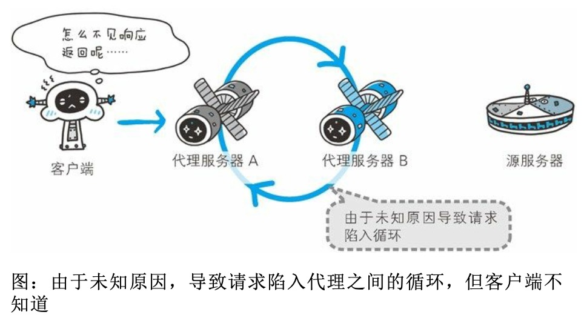

##  HTTP首部

HTTP协议的请求和响应报文中必定包含HTTP首部

### 6.1   HTTP报文首部


HTTP协议的请求和响应报文必定包含HTTP首部。首部内容为客户端和服务器分别处理请求和响应提供所需要的信息。

**HTTP请求报文**

在请求中，HTTP报文由方法，URI，HTTP版本，HTTP首部字段等部分构成。


 **HTTP响应报文**

在响应中，http报文由http版本、状态码（数字和原因短语）、http首部字段3部分组成


在报文众多的字段当中，HTTP首部字段包含的信息最为丰富。首部字段同时存在于请求和响应报文内，并涵盖HTTP报文相关的内容信息。


###  6.2HTTP首部字段

#### 6.2.1HTTP首部字段传递重要信息

在客户端与服务器之间以HTTP协议进行通信的过程中，无论是请求还是响应都会使用首部字段，它能起到传递额外重要信息的作用

首部字段可以给**浏览器**和**服务器**提供**报文主体大小、所使用的语言、认证信息等内容**

####  6.2.2HTTP首部字段结构

HTTP首部字段是由首部字段名和字段值构成的，中间用冒号“:”分隔。

>  首部字段:字段值

---

EG：

* Content-Type 

  在HTTP首部中以Content-Type 这个字段表示报文主体的 对象类型

  ```
  Content-Type:text/html
  ```

---

字段值对应单个HTTP首部字段可以有多个值

---

eg：

Keep-Alive:timeout=15,max=100

---

> 若HTTP首部出现了两个或两个以上具有相同首部字段名时，会怎么样？
>
> 这种情况在规范内尚未明确，根据浏览器内部处理逻辑的不同，结果可能并不一致。有些浏览器会优先处理第一次出现的首部字段，而有些则会优先处理最后出现的首部字段

####  6.2.3---4种HTTP首部字段类型

根据实际用途被分为4种类型：

* 通用首部字段**（General Header Fields）**

  请求报文和响应报文良方都会使用的首部

* 请求首部字段**（Request Header Fields）**

  从客户端向服务器端发送请求报文时使用的首部。补充了**请求的附加内容、客户端信息、响应内容相关优先级**等信息。

* 响应首部字段**（Respones Header Fields）**

  从服务器端向客户端返回响应报文时使用的首部。补充了**响应的附加内容**，也会要求**客户端附加额外的内容信息**。

* 实体首部字段**（Entity Header Fields）**

  针对请求报文和响应报文的实体部分使用的首部。补充了资源内更新时间等与实体内容有关的信息。


#### 6.2.4---HTTP/1.1首部字段一览

HTTP/1.1 规范定义了如下47种首部字段

**通用首部字段**

| 首部名称          | 说明                       |
| ----------------- | -------------------------- |
| Cache-Contorl     | 控制缓存的行为             |
| Connection        | 逐跳首部、连接的管理       |
| Date              | 创建报文的日期时间         |
| Pragma            | 报文指令                   |
| Trailer           | 报文末端的首部一览         |
| Transfer-Encoding | 指定报文主体的传输编码方式 |
| Upgrade           | 升级为其他协议             |
| Via               | 代理服务器的相关信息       |
| Warning           | 错误通知                   |

**请求首部字段**

| 首部字段名          | 说明                                          |
| ------------------- | --------------------------------------------- |
| Accept              | 用户代理可处理的媒体类型                      |
| Accept-Charset      | 优先的字符集                                  |
| Accept-Encoding     | 优先的内容编码                                |
| Accept-Langeuage    | 优先的语言（自然语言）                        |
| Authorization       | Web认证信息                                   |
| Expect              | 期待服务器的待定行为                          |
| From                | 用户的电子邮箱地址                            |
| Host                | 请求资源所在的服务器                          |
| If-Match            | 比较实体标记（ETag）                          |
| If-Modified-Since   | 比较资源的更新时间                            |
| If-None-Match       | 比较实体标记（与If-Match相反）                |
| If-Range            | 资源未更新时发送实体Byte的范围请求            |
| If-Unmodified-Since | 比较资源的更新时间（与If-Modified-Since相反） |
| Max-Forwards        | 最大传输逐跳数                                |
| Proxy-Authorization | 代理服务器要求客户端的认证信息                |
| Range               | 实体的字节范围请求                            |
| Referer             | 对请求中URI的原始获取方                       |
| TE                  | 传输编码的优先级                              |
| User-Agent          | HTTP客户端程序的信息                          |

**响应首部字段**

| 首部字段名         | 说明                         |
| ------------------ | ---------------------------- |
| Accept-Ranges      | 是否接受字节范围请求         |
| Age                | 推算资源创建经过时间         |
| ETag               | 资源的匹配信息               |
| Location           | 令客户端重定向至指定URI      |
| Proxy-Authenyicate | 代理服务器对客户端的认证信息 |
| Retry-After        | 对再次发起请求的时机要求     |
| Server             | HTTP服务器的安装信息         |
| Vary               | 代理服务器缓存的管理信息     |
| WWW-Authenticate   | 服务器对客户端的认证信息     |

**实体首部字段**

| 首部字段名       | 说明                         |
| ---------------- | ---------------------------- |
| Allow            | 资源可支持的HTTP方法         |
| Content-Encoding | 实体主体适用的编码方式       |
| Content-Language | 实体主体的自然语言           |
| Content-Length   | 实体主体的大小（单位：字节） |
| Content-Location | 代替对应资源的URI            |
| Content-MD5      | 实体主体的报文摘要           |
| Content-Range    | 实体主体的位置范围           |
| Content-Type     | 实体主体的媒体类型           |
| Expires          | 实体主体过期的日期时间       |
| Last-Modified    | 资源的最后修改日期时间       |


### 6.2.5非HTTP/1.1首部字段

在HTTP协议通信交互中使用到的首部字段，不限于RFC2616中定义的47种首部字段。还有Cookie、Set-Cookie 和Content-Disposition等其他TFC中定义的首部字段。

###  6.2.6End-to-end首部和Hop-by-hop首部

Http首部字段将定义成缓存代理和非缓存代理的行为，分成2种类型。

**端到端首部（End-to-end Header）**

分在此类别中的首部会转发给请求/响应对应的最终接收目标，且必须保存在由缓存生成的响应中，另外规定它必须被转发

**逐跳首部（Hop-by-hop Header）**

分在此类别中的首部只对单次转发有效，会因通过缓存代理或代理而不在转发。
HTTP/1.1和之后版本中，如果要使用hop-by-hop 首部，需要提供Connection首部字段

下面举例了HTTP/1.1中的逐跳首部字段。除了这8个首部字段之外，**其他所有字段都属于端到端首部**

* **Connection**
* **Keep-Alive**
* **Proxy-Authenticate**
* **Proxy-Authorization**
* **Trailer**
* **TE**
* **Transfer-Encoding**
* **Upgrade**

###  6.3 HTTP/1.1通用首部字段

> 通用首部字段是指，请求报文和响应报文双方都会使用的首部

###  6.3.1Cache-Control

通过指定首部字段Cache-Control 的指令，就能操作缓存的工作机制。


首部字段Cache-Control 能够控制缓存的行为

指令的参数是可选的，多个指令之间通过“,”分隔。首部字段Cache-Control的指令可以用于请求及响应时。

```http
Cache-Control:private,max-age=0.no-cache
```

* **Cache-Control  指令一览**

**缓存请求指令**

| 指令             | 参数   | 说明                           |
| ---------------- | ------ | ------------------------------ |
| no-cache         | 无     | 强制向源服务再次验证           |
| no-store         | 无     | 不缓存请求或响应的任何内容     |
| max-age=[秒]     | 必须   | 响应的最大Age值                |
| max-stale(=[秒]) | 可省略 | 接收已过期的响应               |
| min-fresh=[秒]   | 必需   | 期望在指定时间内的响应仍然有效 |
| no-transform     | 无     | 代理不可更改媒体类型           |
| only-if-cached   | 无     | 从缓存获取资源                 |
| cache-extension  | -      | 新指令标记（token）            |

**缓存响应指令**

| 指令             | 参数   | 说明                                                 |
| ---------------- | ------ | ---------------------------------------------------- |
| public           | 无     | 可向任意方提供响应的缓存                             |
| private          | 可省略 | 仅向特定用户返回响应                                 |
| no-cache         | 可省略 | 缓存前必须先确认其有效性                             |
| no-store         | 无     | 不缓存请求或响应的任何内容                           |
| no-transform     | 无     | 代理不可更改媒体类型                                 |
| must-revalideta  | 无     | 可缓存但必须向源服务器进行确认                       |
| proxy-revalidate | 无     | 要求中间缓存服务器对缓存的响应<br />有效性在进行确认 |
| max-age=[秒]     | 必需   | 响应的最大Age值                                      |
| s-maxage=[秒]    | 必需   | 公共缓存服务器响应的最大Age值                        |
| Cache-extension  | -      | 新指令标记（token）                                  |


#### 表示是否能缓存的指令

* **pubilc** 指令

  当使用public指令时，则表明其他用户也可利用缓存

  ```http
  Cache-Control:public
  ```

* **private** 指定

  ```http
  Cache-Control:private
  ```

  当指定private指令后，响应只以特定的用户作为对象，这与public指令的行为相反。

  缓存服务器会对该特定用户提供资源缓存的服务，对于其他用户发送过来的请求，代理服务器则不会返回缓存。

* **no-cache**指令

  

  ```
  Cache-Control:no-cache
  ```

  使用no-cache指令的目的是为了防止从缓存中返回过期的资源。

  客户端发送的请求中如果包含no-cache 指令，则表示客户端将不会接收缓存过的响应。于是，“中间”的缓存服务器必须把客户端请求转发给源服务器

  如果服务器返回的响应中包含no-cache指令，那么缓存服务器不能对资源进行缓存。源服务器以后也将不再对缓存服务器请求中提出的资源有效性进行确认，且禁止其对响应资源进行缓存操作

  ```http
  Cache-Control:no-cache=Location
  ```

  由服务器返回的响应中，若报文首部字段Cache-Control 中对 no-cache 字段名具体指定参数值，那么客户端在接受到这个被指定参数值的首部字段对应的响应报文后，就不能使用缓存。换言之，**无参数值的首部字段可以使用缓存。只能在响应指令中指定该参数。**

  

#### 控制可执行缓存的对象的指令

* **no-store指令**

  ```http
  Cache-Control:no-store
  ```

  当使用 no-store 指令时，暗示请求（和对应的响应）或响应中包含机密信息

  > no-cache代表不缓存过期资源，缓存会向源服务器进行有效期确认后处理资源，也称为do-not-serve-from-cache-without-revalidation更合适。no-store 才是真正地不进行缓存

  因此该指令规定缓存不能在本地存储请求或响应的任一部分

####  指定缓存期限和认证的指令

* **s-maxage指令**

  ```http
  Cache-Control:s-maxage=604800(单位:秒)
  ```

  s-maxage指令的功能和max-age指令的相同，它们的不同点是**s-maxage 指令只适用于共多位用户使用的公共缓存服务器**。也就是说**对于向同一用户重复返回响应的服务器来说，这个指令没有任何作用。**

  当使用s-maxage指令后，则直接忽略对Expires首部字段及max-age指令的处理

* **max-age指令**

  ```http
  Cache-Control:max-age=604800(单位:秒)
  ```

  当客户端发送的请求包含max-age指令时，如果判断缓存资源的缓存时间树脂比指定时间的数值更小，那么客户端就接受缓存的资源。另外，当指定max-age值为0，那么缓存服务器通常需要将请求转发给源服务器。

  当服务器返回的响应中包含 max-age 指令时，缓存服务器将不对资源的有效行在做确认，而max-age 数值代表资源保存为缓存的最长时间

  应用 HTTP/1.1 版本的缓存服务器遇到同时存在 Expires 首部字段的情 况时，会优先处理 max-age 指令，而忽略掉 Expires 首部字段。而 HTTP/1.0 版本的缓存服务器的情况却相反，max-age 指令会被忽略掉。

* **min-fresh指令**

  ```http
  Cache-Control:min-fresh=60 (单位:秒)
  ```

  min-fresh指令是要求缓存服务器返回至少还未过指定时间的缓存资源

  比如，当指定min-fresh 为60秒后，过了六十秒的资源都无法作为响应返回了。

* **max-stale 指令**

  ```http
  Cache-Control:max-stale指令
  ```

  使用max-stale 可指示缓存资源，即使过期也照常接收。

  如果指令未指定参数值，那么无论经过多久，客户端都会接收响应; 如果指令中指定了具体数值，那么即使过期，只要仍处于 max-stale 指定的时间内，仍旧会被客户端接收。

* **must-revalidate指令**

  ```http
  Cache-Control:must-revalidate
  ```

  使用must-revalidate指令，代理会向源服务器再次验证即将返回的响应缓存目前是否依然有效。

  若代理无法连通源服务器再次获取有限资源的话，缓存必须给客户端一条504（Gateway Timeout）状态码。

  另外，使用 must-revalidate 指令会忽略请求的 max-stale 指令（即使已经在首部使用了 maxz-stale ，也不会再有效果）。

* **proxy-recalidate 指令**

  ```http
  Cache-Control:proxy-revalidate
  ```

  proxy-revalidate 指令要求所有的缓存服务器在接收到客户端带有该指令的请求返回响应之前，必须再次验证缓存的有效性
  
* **no-transform指令**

  ```http
  Cache-Control:no-transform
  ```

  使用 no-transform指令规定无论是在请求还是响应中，缓存都不能改变实体主体的媒体类型。

  这样可以防止缓存或代理压缩图拍呢等类似操作


####  Cache-Control 扩展

* **cache-extension token**

  ```http
  Cache-Control:private,community="UCI"
  ```

  通过cache-extension 标记（token），可以扩展Cache-Control 首部字段内的指令

  如上例，Cache-Control 首部字段本身没有 community 这个指令。借助 extension tokens 实现了该指令的添加。如果缓存服务器不能理解 community 这个新指令，就会直接忽略。因此，extension tokens 仅对 能理解它的缓存服务器来说是有意义的。


###  6.3.2 Connection

Connection 首部字段具备如下两个作用

* 控制不在转发给代理的首部字段
* 管理持久连接

1. **控制不再转发给代理的首部字段**

   

   ```http
   Connection:不再转发的首部字段名
   ```

   在客户端发送请求和服务器返回的响应内，使用Connection 首部字段，可控制不再转发给代理的首部字段（即Hop-by-hop首部）

2. **管理持久连接**

   

   ```http
   Connection:close
   ```

   HTTP/1.1 版本的默认连接都是持久连接。为此，客户端会在持久连接上连续发送请求。当服务器端明确断开连接时，则指定Connection首部字段的值为Close

   

   ```http
   Connection:Keep-Alive
   ```

   HTTP/1.1之前的HTTP版本的默认连接都是非持久连接。为此，如果想在旧版本的HTTP、协议上维持持续连接，则需要指定Connection 首部字段的值为Keep-Alive


###  6.3.3Date

首部字段Date表明创建HTTP报文的日期和时间。

* RFC1123中规定的时间格式

  ```http
  Date:Tue,03 Jul 2020 04:40:59 GMT
  ```

* RFC850中规定的时间格式

  ```http
  Date:Tue, 03-Jul-12 04:40:59 GMT
  ```

* 还有一种格式。它与 C 标准库内的 asctime() 函数的输出 格式一致。

  ```http
  Data:Tue Jul 03 04:40:59 2012
  ```

###  6.3.4Pragma

pragma 是HTTP/1.1之前版本的历史遗留问题，仅作为与HTTP/1.0的向后兼容而定义

规范定义的形式唯一，如下所示、

```http
Pragma:no-cache
```

该首部字段属于通用首部字段，但只用在客户端发送的请求中。客户端回要求所有的中间服务器不返回缓存的资源。

所有的中间服务器如果都能以HTTP/1.1为基准，那直接采用Cache-Control:no-cache指定缓存的处理方式是最为理想的。

但要整体掌握全部中国南京爱你服务器使用的HTTP协议版本却是不现实的。因此，发送的请求会同时含有下面两个首部字段

```http
Cache-Control:no-cache
Pragme:no-cache
```


###  6.3.5Trailer

首部字段Trailer 会事先说明再报文主体后记录了那些首部字段。该首部字段可应该再HTTP/1.1 版本块传编码时。

```http
HTTP/1.1 200 OK
Date:Tue, 03 Hul 2012 04:40:56 GMT
Content-Type:text/html
...
Transfer-Encoding:chunked
Traile:Expires
...(报文主体)...
0
Expires:Tue,28 Sep 2004 23:59:59 GMT
```

以上用例中，指定首部字段Trailer的值为Expires，在报文主体之后（分块长度0之后）出现了首部字段Expires


###  6.3.6 Transfer-Encoding

首部字段Transfer-Encoding 规定了传输报文主体时采用的编码方式


###  6.3.7Upgrade

首部字段Upgrade用于检测HTTP协议及其他协议是否可使用更高的版本进行通信，其参数值可以用来指定一个完全不同的通信协议


###  6.3.8Via

使用首部字段Via是为了追踪客户端与服务器之间的请求和响应报文的传输路径

报文经过代理或网关时，会先在首部字段Via中附加该服务器的信息，然后在进行转发。这个做法和traceroute 及电子邮件的Received 首部的工作机制很类似。

首部字段Via 不仅用于追踪报文的转发，还可避免请求会还的发生。所以必须在经过代理时附加该首部字段内容。


Via首部是为了追踪传输路径，所以经常会和TRACE方法一起使用。

###   6.3.9Warning

HTTP/1.1的Warning首部是从HTTP/1.0的响应首部（Retry-After）演变过来的

```http
Warning:113 gw.hackr.jp:8080 "Heuristic expiration" Tue,03
Warning:[警告码][警告的主机:端口号]"[警告内容]"([日期时间])
```

警告码列表

| 警告码 | 警告内容                                          | 说明                                                         |
| ------ | ------------------------------------------------- | ------------------------------------------------------------ |
| 110    | Response is stale（响应已过期）                   | 代理返回已过期的资源                                         |
| 111    | Revalidation failed （再验证失败）                | 代理再验证资源有效性时失败<br />（服务器无法到达的原因）     |
| 112    | Disconnection operation（断开链接操作）           | 代理与互联网连接被故意切段                                   |
| 113    | Heuristic expiration（试探性过期）                | 响应的使用期超过24小时（有效缓存的设定时间大于24小时的情况下） |
| 199    | Miscellaneous warning（杂项警告）                 | 任意的警告内容                                               |
| 214    | Transformation applied（使用了转换）              | 代理对某些内容编码或媒体类型执行了某些处理                   |
| 299    | Miscellaneous persistent warning （持久杂项警告） | 任意的警告内容                                               |


##   6.4请求首部字段

请求首部字段是从客户端往服务器端发送请求报文中所使用的字段，用于补充请求的附加信息，客户端信息，响应内容相关的优先级等内容。

###   6.4.1Accept

```http
Accept:text/html,application/xhtml+xml,application/xml;q=0
```

​	Accept首部字段可通知服务器，用户代理能够处理的媒体类型及媒体类型的相对优先级。可使用type/subtype这种形式，一次指定多种媒体类型

* 文本文件

  text/html,text/plain,text/css ...

  Application/xhtml+xml,application/xml ...

* 图片文件

  image/jpeg,image/gif,image/png ...

* 视频文件

  video/mpeg,video/quicktime ...

* 应用程序使用的二进制文件

  application/octet-stream,application/zip ...

比如，如果浏览器不支持PNG图片的显示，那Accept 就不指定image/png，而指定可处理的image/gif和image/jpeg 等图片类型。

若想要给显示的媒体类型增加优先级，则使用**q=**来额外表示权重值，用分号（;）进行分隔。权重值**q**的范围是0～1（可以精确到小数点后3位），且1位最大值。不指定权重**q**值时，默认权重**q=1.0**。

> 在RFC266定义中，此处的q得是指qvalue，即quality factor。直译的话就是质量系数，但经过综合考虑理解记忆的便利性后，似乎采用权重值更为稳妥

### 6.4.2Accept-Charset

```http
Accept-Charset:iso-8859-5,unicode-1-1;q-0.8
```

Accept-Charset首部字段可以用来通知服务器用户代理支持的字符集集字符集的相对优先顺序，另外，可一次性指定多种字符集。与首部字段Accept 相同的是可用权重q值来表示相对优先级。

### 6.4.3 Accept-Encoding

```http
Accept-Encoding:gzip,deflate
```

Accept-Encoding 首部字段用来告知服务器用户代理支持的内容编码及内容编码的优先级顺序。可一次性指定多种内容编码。

* **gzip**

  有文件压缩程序gzip（GNU zip）生成的编码格式（RFC1952），采用Lempel-Ziv算法（LZ77）及32位循环冗余校验（Cyclic Redundancy Check，通称CRC）

* **compress**

  有UNIX文件压缩程序compress生成的编码格式，采用Lempel-Ziv-Welch算法（LZW）

* **deflate**

  组合使用zlib格式（RFC950）及由deflate压缩算法（RFC951）生成的编码格式

* **identity**

  不执行压缩或不会变化的默认编码格式

### 6.4.4 Accept-Language

```http
Accept-Language:zh-cn,zh;q=0,7,en-us,en;q=0.3
```

首部字段Accrpt-Language 用来告知服务器用户代理能够处理的自然语言集（指中文或英文等）,以及自然语言集的相对优先级。可一次指定多种自然语言集

### 6.4.5Authorization

```http
Authorization:Basic dWVub....==
```

首部字段Authorization 是用来告知服务器，用户代理的认证信息（证书值）。通常，想要通过服务器认证的用户代理会在接收到返回的401状态吗响应后，把首部字段Authorization 加入请求中。共用缓存在接受到含有Authoriation 首部字段的请求时的操作处理会略有差异

### 6.4.6 Expect

```http
Expect: 100-continue
```

客户端使用首部字段Expect 来告知服务器，期望出现的某种特定行为。因为服务器无法理解客户端的期望作出回应而发生错误时，会返回状态码417Expectation Failed

客户端可以利用该首部字段，写明所期望的扩展。虽然HTTP/1.1规范只定义了100-continue（状态码100 Continue）

### 6.4.7 From

首部字段From 用来告知服务器使用用户代理的用户的电子邮件地址。通常，其实用的目的就是为了显示搜搜引擎等用户代理的负责人的电子邮件联系方式。使用代理时，应尽可能包含在From首部字段（但可能会因代理不同，将电子邮件地址记录在User-Agent 首部字段内）。

### 6.4.8 Host


```http
Host:www.hackr.jp
```

首部字段Host 或告知服务器，请求的资源所在互联网主机名和端口号。Host 首部字段在HTTP/1.1 规范内是唯一一个必须被包含在请求内的首部字段。

首部字段**Host 和以单台服务器分配多个域名的虚拟主机的工作机制有很密切的关连**，这是首部字段Host 必须存在的意义

**请求被发送至服务器时，请求中的主机名会用IP地址直接替换解决。但如果这时，相同的IP地址下部署运行着多个域名，那么服务器就会无法理解究竟是哪个域名对应的请求。因此，就需要使用首部字段Host 来明确指出请求的主机名。若服务器未设定主机名，那直接发送一个空值即可。**

```http
Host: 
```

### 6.4.9 If-Match


**形如If-xxx这种样式的请求首部字段，**都可以称为请求条件请求。服务器接收到附带条件的请求后，只有判断指定条件为真是，才会执行请求。


```http
If-Match:"123456"
```

首部字段If-Match ，属附带条件之一，他会告知服务器匹配资源所用的实体标记（ETag）值。这时的服务器无法使用弱ETag值。

服务器会比对If-Match的字段值和资源的ETag值，仅当两者一致时，才会执行请求。反之，则返回状态码412Precondition Failed 的响应。

还可以使用星号（*）指定If-Match 的字段值。针对这种情况，服务器将会忽略ETag的值，只要资源存在就处理请求

### 6.4.10If-Modified-Since


```http
If-Modified-Since:Thu,15 Apr 2004 00:00:00 GMT
```

首部字段If-Modified-Since 属附带条件之一，它会告知服务器If-Modified-Since 字段值早于

资源的更新时间，则希望处理该请求。而在指定If-Modified-Since 字段值的日期时间之后，如果请求的资源都没有过更新，则返回状态码304Not Modified 的响应。

If-Modified-Since用于确认代理或客户端拥有的本地资源的有效性。获取资源的更新日期时间，可以通过确认首部字段Last-Modified 来确定


### 6.4.11 If-None-Match

首部字段If-None-Match 属于附带条件之一。它和首部字段If-Match 作用相反。用于指定If-None-Match 字段值的实体标记（ETag）值与请求资源的ETag不一致时，他就告知服务器处理改请求。

### 6.4.12 If-Range


首部字段If-Range 属于附带条件之一。他告知服务器若指定的I发R安哥 字段值（ETag值或者时间）和请求资源的ETag值或时间相一致时，则作为范围请求处理。反之，则返回全体资源。


服务器端的资源如果更新，那客户端持有资源中的一部分也会随之无效，当然，范围请求作为前提是无效的。这是，服务器会暂且以状态码412 Precondition Failed 作为响应返回，其目的是催促客户端再次发送请求。这样一来，与使用首部字段If-Range 比起来，就需要花费两杯的功夫。


### 6.4.13 If-unmodified-Since

```http
If-Unmodified-Since:Thu,03 Jul 2012 00:00:00 GMT
```

首部字段If-Unmodified-Since和首部字段 If-Modified-Since 的作用相反。它的作用的是告知服务器，指定的请求资源只有在字段值内指定的日期之后，未发生更新的情况下，才能处理请求。如果在指定日期时间后发生了更新，则已状态码412 PreconditionsFailed 作为响应返回。

### 6.4.14 Max-Forward


```http
Max-Forwards:10
```

通过TRACE方法或OPTIONS方法，发送包含首部字段Maax-Forwards 的请求时，该字段一是禁止整数形式指定可经过的服务器最大数目。服务器在往下一个服务器转发请求之前，Max-Forwards 的值减1后重新赋值。当服务器接收到Max-Forwards值为0的请求时，则不在进行转发，而是直接返回响应

使用HTTP协议通信时，请求可能会经过代理等多台服务器。途中，如果代理服务器由于某些原因导致请求转发失败，客户端也就等不到服务器返回的响应了




### 6.4.15 Proxy-Authorization

```http
Proxy-Authorization:Basic dGlwOjkpNLAGfFY5
```

接收到从代理服务器发来的认证质询时，客户端会发送包含首部字段Proxy-Authorization 的请求，以告知服务器认证所需要的信息。

这个行为是与客户端和服务器之间的HTTP访问认证类似的，不同之处在于，认证行为发生在客户端与代理之间。客户端与服务器之间的认证，使用首部字段Authorication 可以起到相同作用

### 6.4.16 Range

```http
Range:bytes=5001-10000
//表示请求获取从第5001字节至第10000字节的资源。
```

对于只需获取部分资源的范围请求，包含首部字段Range即可告知服务器资源的指定范围。

接收到附带Range首部字段请求的服务器，会在处理请求之后返回状态码为206Partial Content 的响应。无法处理该范围请求时，则会返回状态码200OK的响应集全部资源。

### 6.4.17 Referer

```http
Referer:http://www.hackr.jp/index.html
```

首部字段Referer 会告知服务器请求的原始资源的URI

客户端一般都会发送Referer首部字段给服务器。但当直接在浏览器的地址来输入URI，或出于安全性的考虑时，也可以不发送该首部字段。

因为**原始资源的URI中的查询字符串可能含有ID和密码等保密信息**要是写进Referer转发给其他服务器则可能导致保密信息泄露

### 6.4.18TE

```http
TE:gzip,default ; q=0.5
```

首部字段TE会告知服务器客户端能够处理响应的传输编码方式及相对优先级。它对首部字段Accrpt-Encoding的功能更很像，但是用于传输编码。

首部字段TE除指定传输编码之外，还可以指定伴随trailer 字段的分块传输编码的方式。应用后者时，只需要把trailers 赋值给该字段值

```http
TE:trailers
```

### 6.4.19 User-Agent

```http
User-Agent:Mozilla/5.0(windows NT 6.1;WOW64;rv:13.0) G
```

首部字段User-Agent 将会创建请求的浏览器和用户代理名称等信息传递给服务器。


## 6.5响应首部字段

### 6.5.1 Accept-Ranges

```http
Accept-Ranges:bytes
```

首部字段Accept-Ranges 是用来告知客户端服务器是否能处理范围请求，以指定获取服务器端某个部分的资源

可指定的字段值有两种，可处理范围请求时指定其为bytes，反之则指定其为none

### 6.5.1 Age

```http
Age:600
```

首部字段Age能告知客户端，源服务器在多久前创建了响应。字段值的单位为秒。

若创建该响应的服务器时缓存服务器，Age值是指缓存后的响应再次发起认证到认证完成的时间值。代理创建响应时必须加上首部字段Age

### 6.5.3ETag

首部字段**ETag 能告知客户端实体标识**。**它是一种可将资源以字符串形式作唯一性标识的方式**。服务器会为每分资源分配对应的ETag值。

当资源更新时，ETag值也需要更新。生成ETag值时，并没有统一的算法规则，而仅仅是由服务器来分配

**资源被缓存时，就会被分配唯一性标识**

**强ETag值和弱ETag值**

ETag中有强ETag值和弱ETag值之分

* **强ETag值**

  强ETag值，不论实体发生多么细微的变化都会改变其值

  ```http
  ETag:"usagi-1234"
  ```

* **弱ETag值**

  弱ETag值只有勇于提示资源是否相同。只有在资源发生了根本改变，产生差异时才会改变ETag值。这是，会在字段值最开始处附加W/

  ```http
  ETag:W/"usagi-1234"
  ```

### 6.5.4 Location

使用首部字段Location 可以将响应接收放引导至某个与请求URI位置不同的资源

基本上，该字段会配合3xx:Redirection 的响应，提供重定向的URI

几乎所有浏览器在接受到包含首部字段Location的响应后，都会强制性的尝试对已提示的重定向资源的访问


### 6.5.5 Proxy-Authenticate

```http
Proxy-Authenticate:Basic realm="Usagidesign Auth"
```

首部字段Proxy-Authenticate 会把由代理服务器所要求的认证信息发送给客户端

它与客户端和服务器之间的HTTP访问认证的行为相似，不同之处在于其认证行为时在客户端与代理之间进行的。而客户端与服务器之间进行认证时，首部字段WWW-Authorization 有着相同的作用

### 6.5.6 Retry-After

```http
Retry-After:120
```

首部字段Retry-After 告知客户端应该在多久之后再次发送请求。主要配合状态码 503 Service Unavailable 响应，或 3xx Redirect 响应一起使用。

### 6.5.7 Server

```http
Server:Apache/2.2.17(Unix)
```

首部字段Server 告知客户端当前服务器上安装的HTTP服务器应用程序的信息。不单单会标出服务器上的软件应用名称，还有可能包括版本号和安装时启用的可选项。

```http
Server:Apache/2.2.6(Unix) PHP/5.2.5
```

### 6.5.8 Vary


```
Vary:Accept-Language
```

首部字段Vary可对缓存进行控制。源服务器会向代理服务器传达关于本地缓存使用方法的命令。

从代理服务器接收到源服务器返回包含Vary 指定项的响应之后，若再要进行缓存，仅对请求中含有相同Vary指定首部字段的请求返回缓存。即使对相同资源发起请求，但由于Vary指定的首部字段不相同，因此必须要从源服务器冲洗获取资源。

### 6.5.9 WWW-Authenticate

```http
WWW-Authenticate:Basic realm="Usagidesign Auth"
```

首部字段WWW-Authenticate 用于HTTP访问认证。他会告知客户端适用于访问请求URI所指定资源的认证方案（Basic或是 Digest）和带参数提示的质询（challenge）。状态码401Unauthorized 响应中，肯定带有首部字段WWW-Authenticate。


## 6.6 实体首部字段

实体首部字段是包含在请求报文和响应报文中的实体部分所使用的首部，用于补充内容的更新时间等与实体相关的信息。

### 6.6.1 Allow


```http
Allow:GET,HEAD
```

首部字段Allow 用于通知客户端能够支持Request-URI 指定资源的所有HTTP方法。当服务器接收到不支持的HTTP方法时，会以状态码405 Method Not Allowed 作为响应返回。与此同时，还会把所有能支持的HTTP方法写入首部字段Allow后返回


### 6.6.2 Content-Encoding

```http
Content-Encoding:gzip
```

首部字段**Content-Encoding 会告知 客户端服务器对实体的主体部分选用的内容编码方式**。**内容编码指的是在不丢失实体信息的前提下所进行的压缩**

* gzip
* compress
* deflate
* identity

### 6.6.3 Content-Language

```http
Content-Language:zh-CN
```

首部字段Content-Language 会告知客户端，实体主体使用的自然语言（指中文或英语等语言）

### 6.6.4 Content-Length

```http
Content-Langth：15000
```

首部字段Content-Length 表明了实体主体部分的大小（单位是字节）

### 6.6.5 Content-Location

```http
Content-Location:http://www.hackr.jp/index-ja.html
```

首部字段 Content-Location 给出与报文肢体部分相对应的URI 。 和首部字段 Location 不同 ，Content-Location 表示的是报文主体返回资源对应的URI

> 比如，对于使用首部字段 Accept-Language 的服务器驱动型请求，当 返回的页面内容与实际请求的对象不同时，首部字段 Content-Location 内会写明 URI。

### 6.6.6 Content-MD5


```http
Content-MD5:OGFkZDU......
```

首部字段 Content-MD5 是一串由MD5 算法生成的值，其目的在于检查报文主体在传输过程中是否保持完整，以及确认传输达到。

**对报文主体执行MD5 算法获得的128位二进制数，再通过Base64 编码 后将结果写入 Content-MD5字段值。由于HTTP首部无法记录二进制值，所以要通过Base64编码处理。为确保报文的有效性，作为接收方的客户端会对报文主体在执行一次相同的MD5算法。计算出的值和字段值作比较后，即可判断出报文的准确性。**

采用这种方法,对内容上的偶发性改变事物从查证的，也无法检测出恶意篡改。其中一个原因在于，内容如果能够被篡改，那么意味着 Content-MD5也可重新计算然后被篡改。所以在接受阶段的客户端是无法意识到报文主体以及首部字段Content-MD5 是已经被篡改过的

### 6.6.7 Content-Range


```http
Content-Range:bytes 5001-10000/10000
```

针对范围请求，返回响应时使用的首部字段Content-Range，能告知客户端作为响应返回的实体的那个部分符合范围请求。字段值以字节为单位，表示当前发送部分及整个实体大小。

### 6.6.8 Content-Type

```http
Content-Type:text/html;charset=UTF-8
```

首部字段Content-Type 说明了实体主体对象的媒体类型。和首部字段Accept一样，字段值用了type/subtype形式赋值。

参数charset使用iso-8859-1或euc-jp 等字符集进行赋值

### 6.6.9 Expires


```http
Expires:Wed,04 Jul 2012 08:26:05 GMT
```

首部字段Expires 会将资源失效的日期告知客户端。缓存服务器在接收到含有首部字段Expires 的响应后，会以缓存来答应请求，在Expires 字段值指定的时间之前，响应的副本会一直被保存。当超过指定的时间后，缓存服务器在请求发送过来时，会转向源服务器请求资源。

源服务器不希望缓存服务器对资源缓存时，最好在Expires字段内写入与首部字段Date相同的时间值

但是，当首部字段Cache-Control 有指令max-age指令时，比起首部字段Expires ，会优先处理max-age 指令。


### 6.6.10 Last-Modified


```http
Last-Modified:Wed,23 May 2012 09:59:55 GMT
```

首部字段**Last-Modified 指明资源被修改的时间。** 一般来说，这个值就是Request-URI 指定资源被修改的时间。但类似使用CGI脚本行动态处理时，改制有可能会变成数据最终修改时的时间


## 6.7 位Cookie 服务的首部字段

> Cookie 管理服务器与客户端之间的状态

Cookie的工作机制是用户识别及状态管理。Web网站为了管理用户的状态会通过Web浏览器浏览器，把一些数据临时写入用户的计算机内。接着当用户访问该Web网站时，可以通过通信方式取回之前发放的Cookie

调用Cookie时，由于可校验Cookie的有效期，以及发送方的域、路径、协议等信息，所以正规发布的Cookie内的数据不会因为来自其他Web站点和攻击者的攻击而泄露。

至2013年5月，Cookie 的规格标准文档有以下4种。

> 由网景公司颁布的规格标准
>
> 网景通信公司设计并开发了Cookie ，并制定相关的规格标准，1994 年前后，Cookie正式应用在网景浏览器中。目前最为普及的Cookie方式也是以此为基准的

**RFC2109**

某企业尝试以独立技术对Cookie 规格进行标准化统筹，原本意图时想和网景公司指定的标准交互应用，可惜发生了微妙的差异。现在该标准已淡出人们的视线

**RFC2965**

为终结Internet Explorer 浏览器与Netscape Naviagtion 的标准差异而导致的浏览器战争，RFC2965内定义了新的HTTP首部Set-Cookie2和Cookie2.可事实上，它们几乎没怎么投入使用。

#### **RFC6265**

将网景公司定制的标准作为业界事实标准（De facto standard），重新定义Cookie 标准后的产物

目前使用最广泛的Cookie 标准却不是RFC中定义的任何一个。而是在网景公司制定的标准上进行扩展后的产物

**为Cookie服务的首部字段**

| 首部字段名 | 说明                           | 首部类型     |
| ---------- | ------------------------------ | ------------ |
| Set-Cookie | 开始状态管理所使用的Cookie信息 | 响应首部字段 |
| Cookie     | 服务器接收到Cookie信息         | 请求首部字段 |

### 6.7.1 Set-Cookie

```http
Set-Cookie:status=enable;expires=Tue,05 Jul 2011 07:26:31
```

在服务器准备开始管理客户端的状态时，会事先告知各种信息。

**Set-Cookie 字段的属性**

| 属性         | 说明                                                         |
| ------------ | ------------------------------------------------------------ |
| NAME=VALUE   | 赋予Cookie的名称和其值（必需项）                             |
| expires=DATE | Cookie的有效期（若不明确指定则默认为浏览器关闭前为止         |
| path=PATH    | 将服务器上的文件目录作为Cookie的适用对象（若不指定则默认为文档所在的目录） |
| domain=域名  | 作为Cookie适用对象的域名（若不指定则默认为创建Cookie的服务器的域名） |
| Secure       | 仅在HTTPS安全通信时才会发送Cookie                            |
| HttpOnly     | 加以限制，使用Cookie不能被JavaScript脚本访问                 |

**expires**属性

Cookie 的expires 属性指定浏览器可发送Cookie的有效期

当省略expires属性时，其有效期仅限于维持浏览器会话（Session）时间短哪。这通常限于浏览器应用程序被关闭之前

另外，一旦Cookie从服务器端发送至客户端，服务器端就不存在可以显式删除Cookie的方法。但可通过覆盖已过期的Cookie，视线对客户端Cookie的实质性删除操作。

**path属性**

Cookie的path属性可以用于限制指定Cookie的发送范围的文件目录。不过另有办法可避开这项限制，看来对其作为安全机制的效果不能抱有期待。

**domain属性**

通过Cookie的domain属性指定的域名可以做到与结尾匹配一致。

> 比如,当指定example.com后，除example.com 以外，www.example.com或www2.example.com等都可以发送Cookie
>
> 因此除了针对具体指定的多个域名发送Cookie之外，不指定domain属性显得更安全

**secure 属性**

Cookie的secure属性用于限制Web页面仅在HTTPS安全连接时，才可以发送Cookie

发送Cookie时，指定secure属性的方法如下所示。

```http
Set-Cookie:name=value;secure
```

> 以上例子仅在当前https://www.example.com/（HTTPS）安全连接的情况下才会进行Cookie的回收。也就是说，即使域名相同，http://www.example.com/（HTTP）也不会发生Cookie行为
>
> 当省略secure属性时，不论HTTP还是HTTPS，都会对Cookie进行回收。

**HttpOnly属性**

Cookie的HttpOnly属性是Cookie的扩展功能，它使JavaScript脚本无法获得Cookie。其主要目的为防止跨站脚本攻击（Cross-site scripting，XSS）对Cookie的信息窃取。

发送指定HttpOnly属性的Cookie的方法如下所示

```http
Set-Cookie:name-value;HttpOnly
```

通过上述设置，通常从Web页面内还可以对Cookie进行读取操作，但使用JavaScript的**document.cookie**就无法读取附加HttpOnly属性后的Cookie的内容了。因此，也就无法在XSS中利用JavaScript劫持Cookie了。

虽然是独立的扩展功能，但Internet Explorer 6 SP1 以上版本等当下主流浏览器都已经支持该扩展了。另外 ，该扩展并非为了防止XSS而开发的。

### 6.7.2 Cookie

```http
Cookie:status=enable
```

首部字段Cookie会告知服务器，当客户端想获得HTTP状态管理支持时，就会在请求中包含从服务器接收到的Cookie。接收到多个Cookie时，同样可以以多个Cookie形式发送。

## 6.8 其他首部字段

HTTP首部字段是可以自行扩展的。

* X-Frame-Options
* X-XSS-Protection
* DNT
* P3P

### 6.8.1 X-Freme-Options

```http
X-Frame-Options:DENY
```

首部字段X-Frame-Options属于HTTP响应首部，用于控制网站内容子啊其他Web网站的Frame标签内的显示问题。其主要目的是为了防止点击劫持（clickjacking）攻击

首部字段X-Frame-Optons 有以下两个可指定的字段值

* DENY：拒绝

* SAMEORIGIN：仅同名域名下的页面（Top-level-browsing-context）匹配时许可。（比如，当http://hacke.jp/sample.html 页面为了SAMEORIGIN 时，那么hackr.jp上所有页面的frame都被允许可加载改页面，而example.com等其他域名的页面就不行了）

  支持该首部字段的浏览器有:Internet Explorer 8、Firefox 3.6.9+、 Chrome 4.1.249.1042+、Safari 4+ 和 Opera 10.50+ 等。现在主流的浏览 器都已经支持。

  能在所有的 Web 服务器端预先设定好 X-Frame-Options 字段值是最理 想的状态。

  对 **apache2.conf** 的配置实例

  ```http
  <IfModule mod_headers.c>
  	header append X-FRAME-OPTIONS "SAMEORIGIN"
  </IfModule
  ```

  

### 6.8.2 X-XSS-Protection

```http
X-XSS-Protection:1
```

首部字段X-XSS-Protection 属于HTTP响应首部，它是针对跨站间本攻击的一种对策，用于控制浏览器XSS防护机制的开关。

首部字段X-XSS-Protection 可以指定的字段值如下。

* 0:将XSS过滤设置成无效状态
* 1:将XSS过滤设置成有效状态


### 6.8.3 DNT


```http
DNT:1
```

首部字段DNT属于HTTP请求首部，其中DNT时Do Not Track的简称，意为拒绝个人信息被收集，是表示拒绝被精准广告追踪的一种方法

首部字段DNT可指定的字段值如下：

* 0:同于被追踪
* 1:拒绝被追踪

由于首部字段DNT的功能具备有效，所以Web服务器需要对DNT做对应的支持


### 6.8.4 P3P

```http
P3P:CP="CAO DSP LAW CURa ADMa DEVa TAIa PSAa PSDa IVAa "
```

首部字段P3P 属于HTTP **响应首部**，通过利用P3P（The Platform for Privacy Preferences，在线隐私偏好平台）技术，可以让Web网站上的飞人隐私变成一种仅供程序可理解的形式，以达到保护用户隐私的目的。

要进行P3P的设定，需按以下操作步骤进行。

1. 创建P3P隐私
2. 创建P3P隐私对照文件后，保存命名在/w3c/p3p.html
3. 从P3P隐私中新建Compact policies 后输出到HTTP响应中


