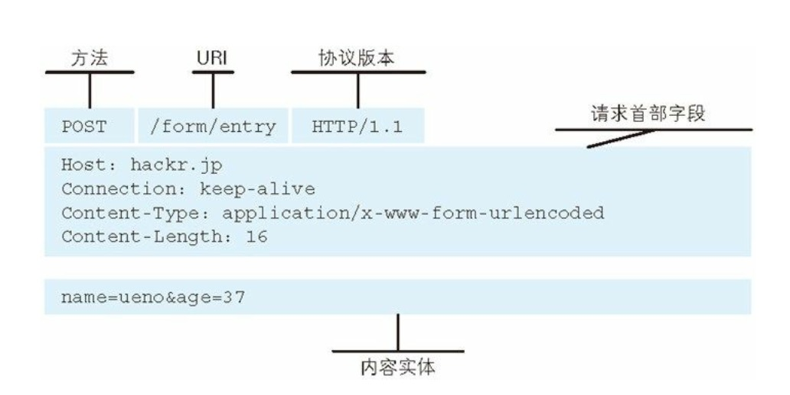
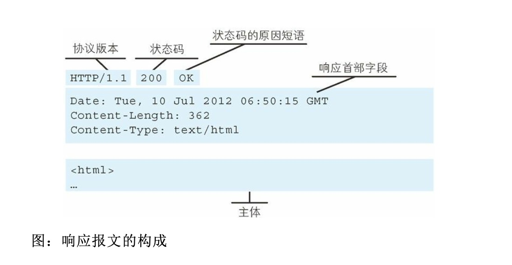
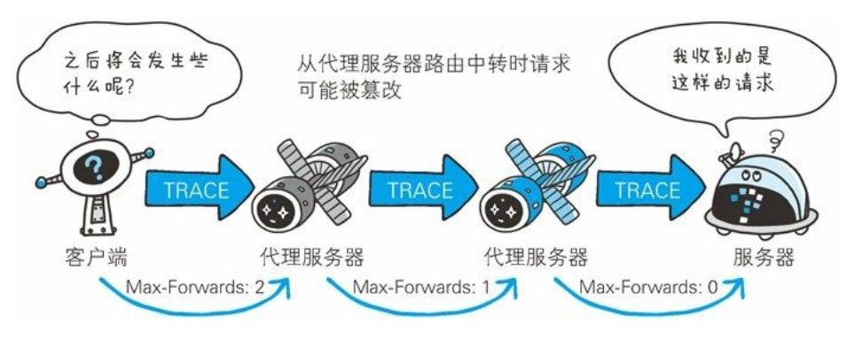
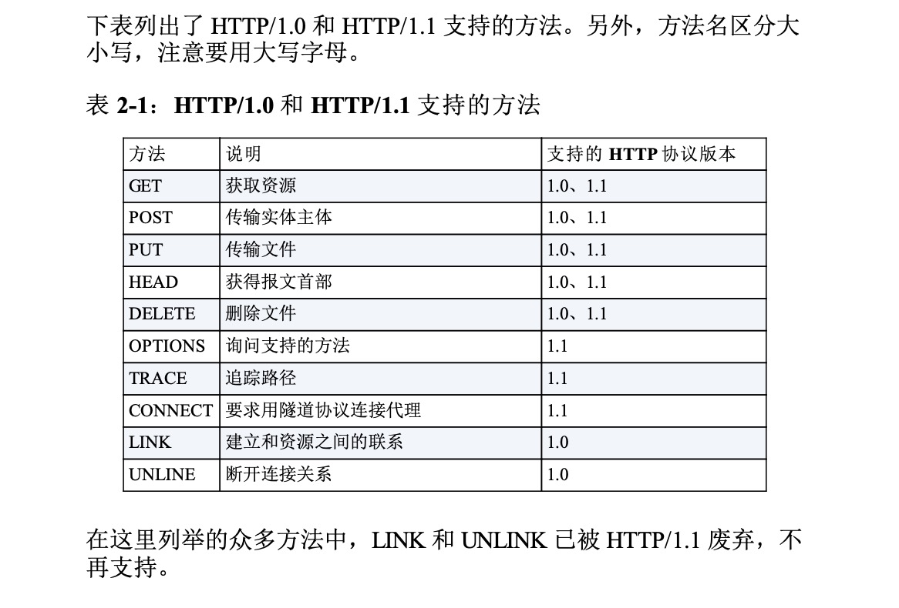
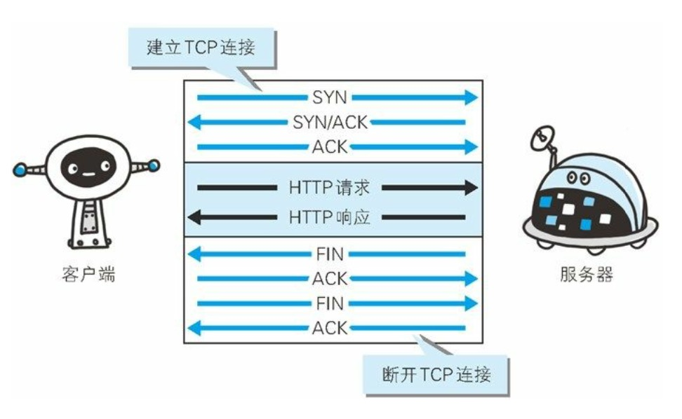
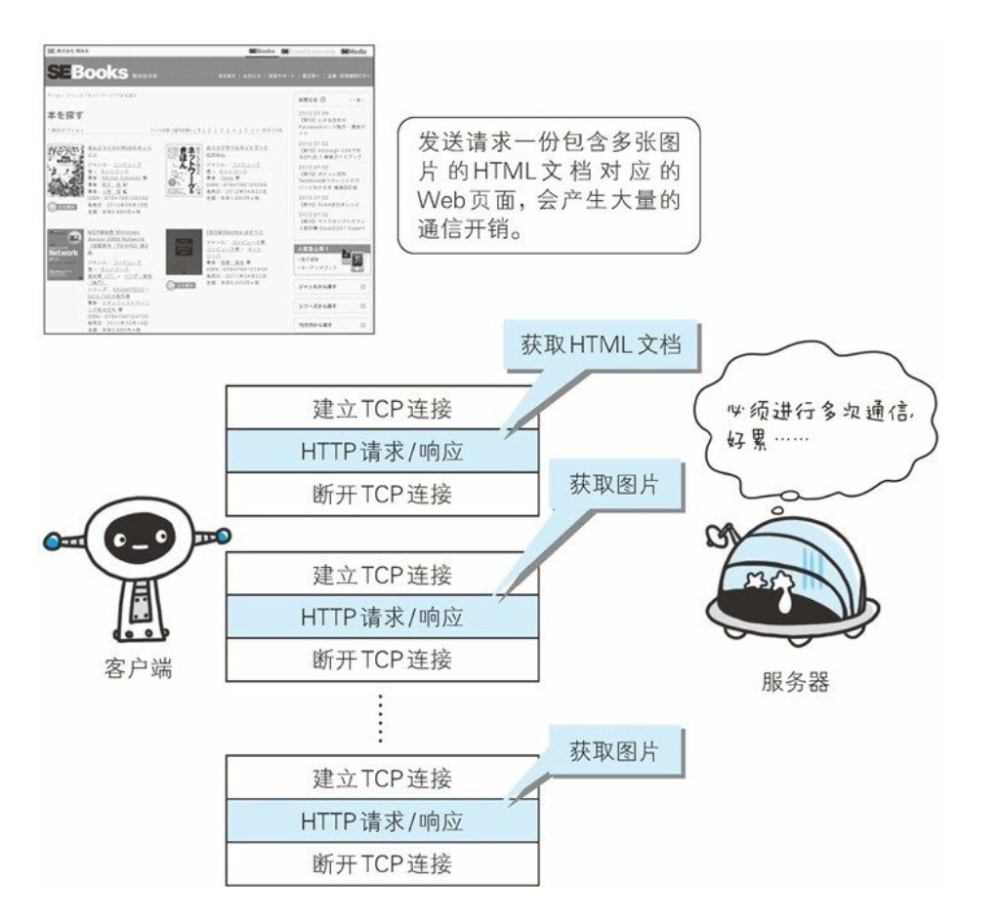
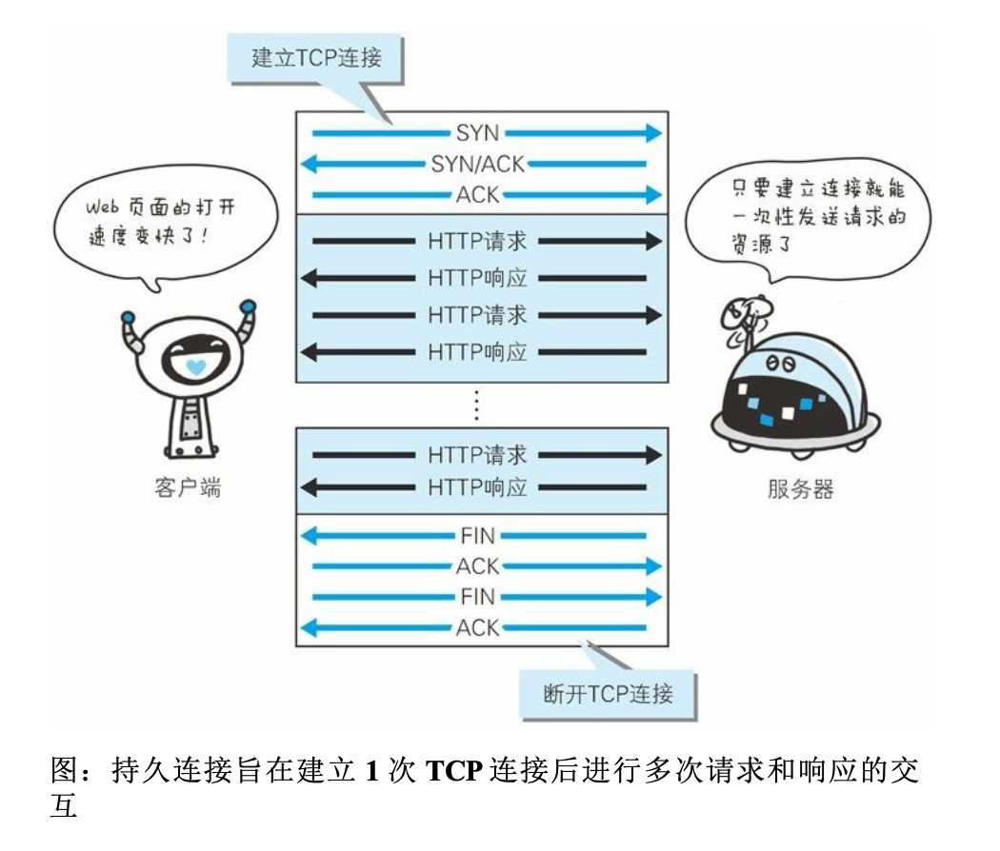
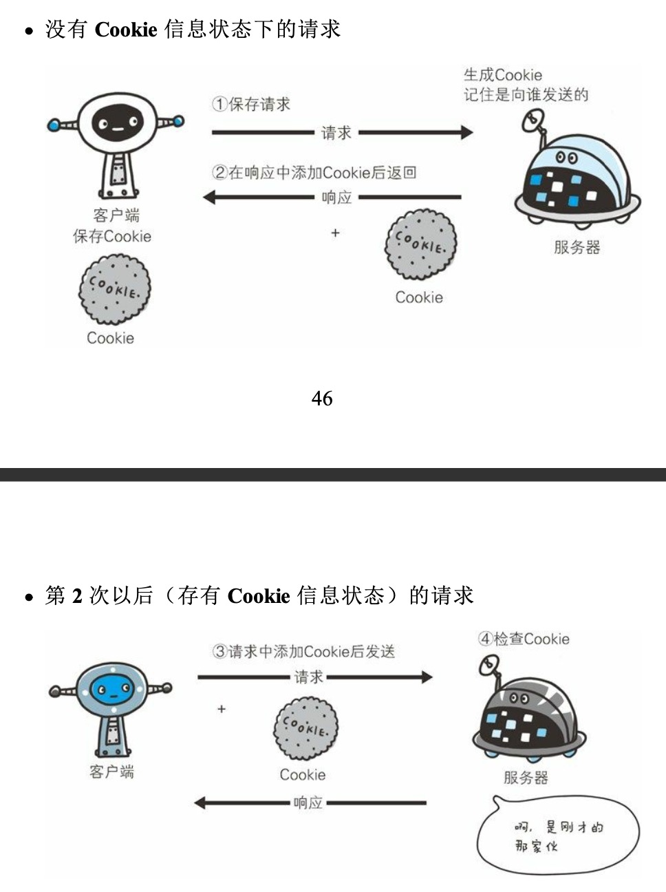

###简单的HTTP协议

#### 2.1 HTTP协议用于客户端和服务器之间的通信

####2.2通过请求和响应的交换达成通信

HTTP 协议规定，请求从客户端发出，最后服务器端响应该请求并返 回。换句话说，肯定是先从客户端开始建立通信的，服务器端在没有 接收到请求之前不会发送响应。

客户端向服务器发送 **请求报文 是由请求方法（method） 、请求URI，协议版本、可选的请求首部字段和内容实体构成。**

图:请求报文的构成

服务器响应客户端 **响应报文 ：基本上由 协议版本、状态码（表示请求成功或失败的数字代码）、用以解释状态码的原因的短语、可选的响应首部字段以及实体主体构成。**

#### 2.3HTTP是不保存状态的协议

HTTP是一种不保存状态，即无状态（stateless）协议。HTTP协议自身不对请求和响应之间的通信状态进行保存。也就是说在HTTP这个级别，协议对于发送过的请求或响应都不能做持久化处理。

使用HTTP协议，没当有新的请求发送时，就会有对应的新响应产生。

HTTP/1.1 虽然是无状态协议，但为了实现期望的状态功能，于是引入了Cookie技术。

#### 2.4请求URI定位资源

HTTP协议 使用URI定位互联网上的资源。

#### 2.5告知服务器意图的HTTP方法

GET:获取资源

POST: 传输实体主体
      POST方法用来传输实体的主体

PUT: 传输文件
鉴于 HTTP/1.1 的 PUT 方法自身不带验证机制，任何人都可以 上传文件 , 存在安全性问题，因此一般的 Web 网站不使用该方法。

**HEAD**:获得报文首部
HEAD方法和GET方法一样，只是不返回报文主体部分。用于确认 URI 的有效性及资源更新的日期时间等。

**DELETE**:删除文件
DELETE方法用来删除文件，但是，HTTP/1.1 的 DELETE 方法本身和 PUT 方法一样不带验证机 制，所以一般的 Web 网站也不使用 DELETE 方法。当配合 Web 应用 程序的验证机制，或遵守 REST 标准时还是有可能会开放使用的。

**OPTIONS**:询问支持的方法
OPTIONS方法用来查询针对请求URI指定的资源支持的方法

**TRACE**:追踪路径
TRACE方法是让那个Web服务器端将之前的请求通信环 回给客户端的方法
发送请求时，在 Max-Forwards 首部字段中填入数值，每经过一个服 务器端就将该数字减 1，当数值刚好减到 0 时，就停止继续传输，最 后接收到请求的服务器端则返回状态码 200 OK 的响应。
TRACE 方法本来就不怎么常用，再加上它容易引发 XST(Cross-Site Tracing，跨站追踪)攻击，通常就更不会用到了。

**CONNECT**:要求用隧道协议连接代理
CONNECT 方法要求在与代理服务器通信时建立隧道，实现用隧道协 议进行 TCP 通信。主要使用 SSL(Secure Sockets Layer，安全套接 层)和 TLS(Transport Layer Security，传输层安全)协议把通信内容 加 密后经网络隧道传输。

####2.6使用方法下达命令

#### 2.7持久连接节省通信量

HTTP协议的初始版本中，每进行一次HTTP通信就要断开一次TCP连接

##### 2.7.1持久连接

未解决上述TCP连接的问题，HTTP/1.1和一部分的HTTP/1.0想出了持久连接（HTTP Persistent Connections，也称为HTTP keep-alive或HTTP connection reuse）的方法。持久连接的特点是，只要任意一端没有明确提出断开连接，则保持TCP连接状态

持久连接的好处在于减少了TCP连接的重复建立和断开所造成的额外开销，减轻了服务器的负载。

在HTTP/1.1中，所有的连接默认都是持久连接，但在HTTP/1.0内并未标准化。

##### 2.7.2管线化

持久连接使得多数请求以管线化（pipelining）方式发送成为可能。
不需要一个接一个地等待 响应，直接发送下一个请求。

##### 2.8使用Cookie的状态管理

HTTP 是无状态协议，它不对之前发生过的请求和响应的状态进行管理。也就是说，无法根据之前的状态进行本次的请求处理。

> 假设要求登录认证的 Web 页面本身无法进行状态的管理(不记录已 登录的状态)，那么每次跳转新页面不是要再次登录，就是要在每次 请求报文中附加参数来管理登录状态。

保留无状态协议这个特征的同时又要解决类似的矛盾问题，于是引入 了 Cookie 技术。**Cookie 技术通过在请求和响应报文中写入 Cookie 信 息来控制客户端的状态。**

Cookie 会根据从服务器端发送的响应报文内的一个叫做 Set-Cookie 的 首部字段信息，通知客户端保存 Cookie。当下次客户端再往该服务器 发送请求时，客户端会自动在请求报文中加入 Cookie 值后发送出 去。

