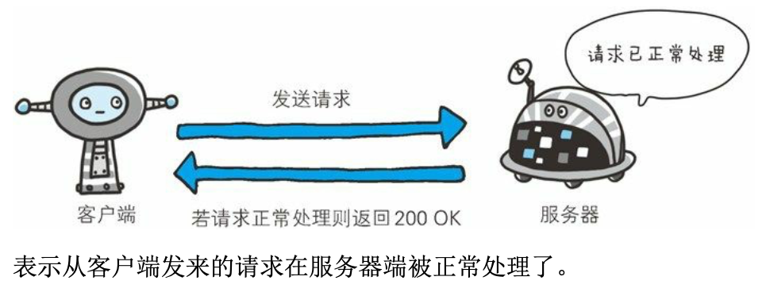

### 4.1状态码告知从服务器端返回的请求结果

只要遵守状态码类别的定义，即使改变RFC2616中定义的状态码，或服务器端自行创建状态码都没问题

仅记录在RFC2616 上的HTTP状态码就达40种，若再加上WebDAV（Web-based Distributed Authoring and Versioning，基于万维网的分布式创作和版本控制）（RFC4918、5842）和附加HTTP状态码（RFC6585）等扩展，数量就达60余种。但实际上经常使用的大概只有14种

### 4.2   2xx成功

2XX 的响应结果表明请求被正常处理了

#### 4.2.1  200OK

#### 4.2.2  204No Content

该状态码表示服务器接收的请求已成功处理，但是返回的响应报文中不含实体的主体部分。另外，也不允许返回任何实体的主体

一般在只需要从客户端往服务器发送信息，而对客户端不需要发送新信息内容的情况下使用

#### 4.2.3 206 Partial Content

该状态码表示客户端进行了范围请求，而服务器成功执行了这部分的GET请求，响应报文中包含由Content-Range 指定范围的实体内容

### 4.3   3XX重定向

3XX响应结果表明浏览器需要执行某些特殊的处理以正确处理请求

#### 4.3.1   301  Moved Permanently

永久性重定向。该状态码表示请求的资源已经被分配了新的URI，以后应使用资源现在所指的URI

####  4.3.2  302 Found

临时性重定向。该状态码表示请求的资源已被分配了新的 URI，希望 用户(本次)能使用新的 URI 访问。

#### 4.3.3  303 See Other

该状态码表示由于请求对应的资源存在着另一个 URI，应使用 GET 方法定向获取请求的资源。

#### 4.3.4 304 Not Modified

该状态码表示客户端发送**附带条件**的请求时，服务器端允许请求访问资源，但未满足条件的情况。304状态码返回时，不包含任何响应的主体部分。304虽然被划分在3XX类别中，但是和重定向没有关系。

附带条件的请求是指采用GET方法的请求报文中包含 If-Match 、If-Modified-Since、If-None-Match、If-Range、If-Unmodified-Since 中任一首部

####4.3.5  307 Temporary Redirect

临时重定向。该状态码与302Found有着相同的含义

307 会遵照浏览器标准，不会从 POST 变成 GET。但是，对于处理响应时的行为，每种浏览器有可能出现不同的情况。

### 4.4 4XX客户端错误

4XX的响应结果表明客户端事发生错误的原因所在。

#### 4.4.1 400 Bad Request

该状态码表示请求报文中存在语法错误

#### 4.4.2 401 Unauthorized

该状态码表示发送的请求需要有通过HTTP认证（BASIC认证、DIGEST认证）的认证信息。另外若之前已进行过1次请求，则表示用户认证失败

#### 4.4.3 403 Forbidden

该状态码表明对请求资源的访问被服务器拒绝了

#### 4.4.4 404 Not Found

该状态码表明服务器上无法找到请求的资源

### 4.5 5XX服务器错误

5XX的响应结果表明服务器本身发生错误

#### 4.5.1 500 Internal ServerError

该状态码表明服务器端在执行请求时发生了错误。

#### 4.5.2 503 Service Unavailable

该状态码表明服务器暂时处于超负载或正在进行停机维护，现在无法处理请求。

