## HTTP首部

HTTP协议的请求和响应报文中必定包含HTTP首部

###6.1   HTTP报文首部

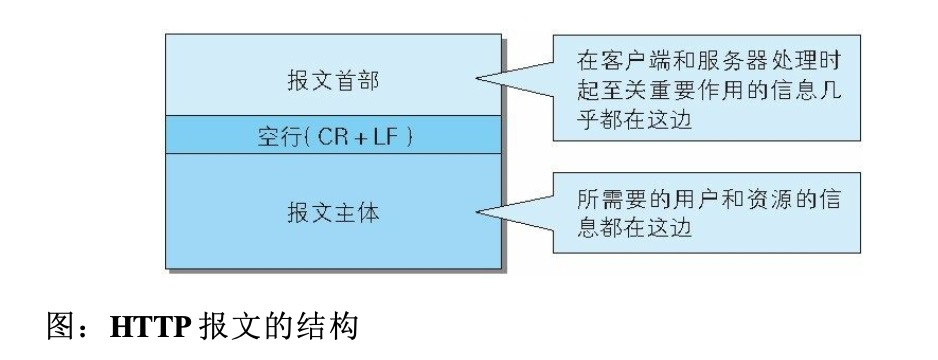

HTTP协议的请求和响应报文必定包含HTTP首部。首部内容为客户端和服务器分别处理请求和响应提供所需要的信息。

**HTTP请求报文**

在请求中，HTTP报文由方法，URI，HTTP版本，HTTP首部字段等部分构成。

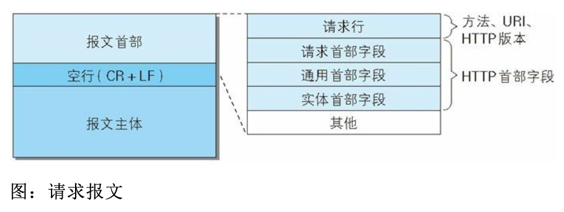


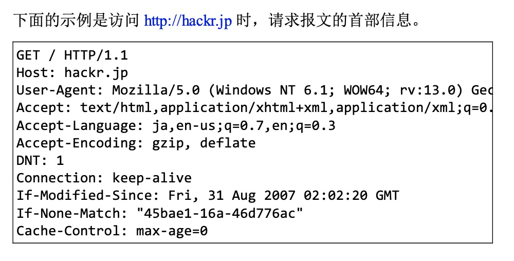

**HTTP响应报文**

在响应中，http报文由http版本、状态码（数字和原因短语）、http首部字段3部分组成

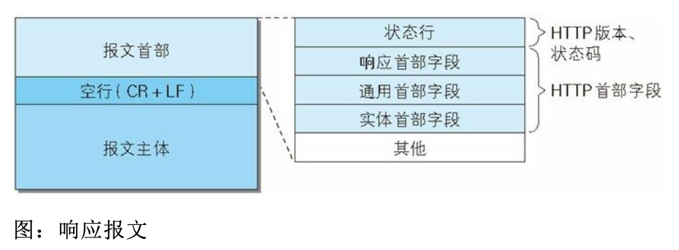


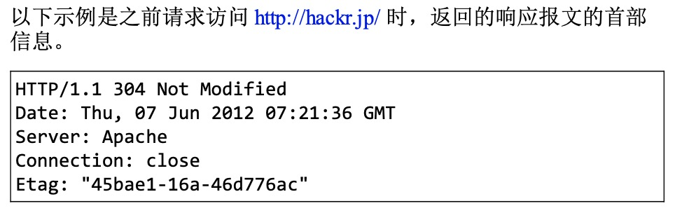

在报文众多的字段当中，HTTP首部字段包含的信息最为丰富。首部字段同时存在于请求和响应报文内，并涵盖HTTP报文相关的内容信息。


### 6.2HTTP首部字段

####6.2.1HTTP首部字段传递重要信息

在客户端与服务器之间以HTTP协议进行通信的过程中，无论是请求还是响应都会使用首部字段，它能起到传递额外重要信息的作用

首部字段可以给**浏览器**和**服务器**提供**报文主体大小、所使用的语言、认证信息等内容**

#### 6.2.2HTTP首部字段结构

HTTP首部字段是由首部字段名和字段值构成的，中间用冒号“:”分隔。

>  首部字段:字段值

---

EG：

* Content-Type 

  在HTTP首部中以Content-Type 这个字段表示报文主体的 对象类型

  ```
  Content-Type:text/html
  ```

---

字段值对应单个HTTP首部字段可以有多个值

---

eg：

Keep-Alive:timeout=15,max=100

---

> 若HTTP首部出现了两个或两个以上具有相同首部字段名时，会怎么样？
>
> 这种情况在规范内尚未明确，根据浏览器内部处理逻辑的不同，结果可能并不一致。有些浏览器会优先处理第一次出现的首部字段，而有些则会优先处理最后出现的首部字段

#### 6.2.3---4种HTTP首部字段类型

根据实际用途被分为4种类型：

* 通用首部字段**（General Header Fields）**

  请求报文和响应报文良方都会使用的首部

* 请求首部字段**（Request Header Fields）**

  从客户端向服务器端发送请求报文时使用的首部。补充了**请求的附加内容、客户端信息、响应内容相关优先级**等信息。

* 响应首部字段**（Respones Header Fields）**

  从服务器端向客户端返回响应报文时使用的首部。补充了**响应的附加内容**，也会要求**客户端附加额外的内容信息**。

* 实体首部字段**（Entity Header Fields）**

  针对请求报文和响应报文的实体部分使用的首部。补充了资源内更新时间等与实体内容有关的信息。


####6.2.4---HTTP/1.1首部字段一览

HTTP/1.1 规范定义了如下47种首部字段

**通用首部字段**

| 首部名称          | 说明                       |
| ----------------- | -------------------------- |
| Cache-Contorl     | 控制缓存的行为             |
| Connection        | 逐跳首部、连接的管理       |
| Date              | 创建报文的日期时间         |
| Pragma            | 报文指令                   |
| Trailer           | 报文末端的首部一览         |
| Transfer-Encoding | 指定报文主体的传输编码方式 |
| Upgrade           | 升级为其他协议             |
| Via               | 代理服务器的相关信息       |
| Warning           | 错误通知                   |

**请求首部字段**

| 首部字段名          | 说明                                          |
| ------------------- | --------------------------------------------- |
| Accept              | 用户代理可处理的媒体类型                      |
| Accept-Charset      | 优先的字符集                                  |
| Accept-Encoding     | 优先的内容编码                                |
| Accept-Langeuage    | 优先的语言（自然语言）                        |
| Authorization       | Web认证信息                                   |
| Expect              | 期待服务器的待定行为                          |
| From                | 用户的电子邮箱地址                            |
| Host                | 请求资源所在的服务器                          |
| If-Match            | 比较实体标记（ETag）                          |
| If-Modified-Since   | 比较资源的更新时间                            |
| If-None-Match       | 比较实体标记（与If-Match相反）                |
| If-Range            | 资源未更新时发送实体Byte的范围请求            |
| If-Unmodified-Since | 比较资源的更新时间（与If-Modified-Since相反） |
| Max-Forwards        | 最大传输逐跳数                                |
| Proxy-Authorization | 代理服务器要求客户端的认证信息                |
| Range               | 实体的字节范围请求                            |
| Referer             | 对请求中URI的原始获取方                       |
| TE                  | 传输编码的优先级                              |
| User-Agent          | HTTP客户端程序的信息                          |

**响应首部字段**

| 首部字段名         | 说明                         |
| ------------------ | ---------------------------- |
| Accept-Ranges      | 是否接受字节范围请求         |
| Age                | 推算资源创建经过时间         |
| ETag               | 资源的匹配信息               |
| Location           | 令客户端重定向至指定URI      |
| Proxy-Authenyicate | 代理服务器对客户端的认证信息 |
| Retry-After        | 对再次发起请求的时机要求     |
| Server             | HTTP服务器的安装信息         |
| Vary               | 代理服务器缓存的管理信息     |
| WWW-Authenticate   | 服务器对客户端的认证信息     |

**实体首部字段**

| 首部字段名       | 说明                         |
| ---------------- | ---------------------------- |
| Allow            | 资源可支持的HTTP方法         |
| Content-Encoding | 实体主体适用的编码方式       |
| Content-Language | 实体主体的自然语言           |
| Content-Length   | 实体主体的大小（单位：字节） |
| Content-Location | 代替对应资源的URI            |
| Content-MD5      | 实体主体的报文摘要           |
| Content-Range    | 实体主体的位置范围           |
| Content-Type     | 实体主体的媒体类型           |
| Expires          | 实体主体过期的日期时间       |
| Last-Modified    | 资源的最后修改日期时间       |


###6.2.5非HTTP/1.1首部字段

在HTTP协议通信交互中使用到的首部字段，不限于RFC2616中定义的47种首部字段。还有Cookie、Set-Cookie 和Content-Disposition等其他TFC中定义的首部字段。

### 6.2.6End-to-end首部和Hop-by-hop首部

Http首部字段将定义成缓存代理和非缓存代理的行为，分成2种类型。

**端到端首部（End-to-end Header）**

分在此类别中的首部会转发给请求/响应对应的最终接收目标，且必须保存在由缓存生成的响应中，另外规定它必须被转发

**逐跳首部（Hop-by-hop Header）**

分在此类别中的首部只对单次转发有效，会因通过缓存代理或代理而不在转发。
HTTP/1.1和之后版本中，如果要使用hop-by-hop 首部，需要提供Connection首部字段

下面举例了HTTP/1.1中的逐跳首部字段。除了这8个首部字段之外，**其他所有字段都属于端到端首部**

* **Connection**
* **Keep-Alive**
* **Proxy-Authenticate**
* **Proxy-Authorization**
* **Trailer**
* **TE**
* **Transfer-Encoding**
* **Upgrade**

### 6.3 HTTP/1.1通用首部字段

> 通用首部字段是指，请求报文和响应报文双方都会使用的首部

### 6.3.1Cache-Control

通过指定首部字段Cache-Control 的指令，就能操作缓存的工作机制。

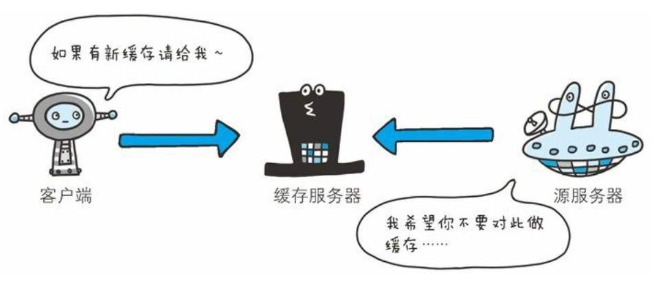

首部字段Cache-Control 能够控制缓存的行为

指令的参数是可选的，多个指令之间通过“,”分隔。首部字段Cache-Control的指令可以用于请求及响应时。

```http
Cache-Control:private,max-age=0.no-cache
```

* **Cache-Control  指令一览**

**缓存请求指令**

| 指令             | 参数   | 说明                           |
| ---------------- | ------ | ------------------------------ |
| no-cache         | 无     | 强制向源服务再次验证           |
| no-store         | 无     | 不缓存请求或响应的任何内容     |
| max-age=[秒]     | 必须   | 响应的最大Age值                |
| max-stale(=[秒]) | 可省略 | 接收已过期的响应               |
| min-fresh=[秒]   | 必需   | 期望在指定时间内的响应仍然有效 |
| no-transform     | 无     | 代理不可更改媒体类型           |
| only-if-cached   | 无     | 从缓存获取资源                 |
| cache-extension  | -      | 新指令标记（token）            |

**缓存响应指令**

| 指令             | 参数   | 说明                                                 |
| ---------------- | ------ | ---------------------------------------------------- |
| public           | 无     | 可向任意方提供响应的缓存                             |
| private          | 可省略 | 仅向特定用户返回响应                                 |
| no-cache         | 可省略 | 缓存前必须先确认其有效性                             |
| no-store         | 无     | 不缓存请求或响应的任何内容                           |
| no-transform     | 无     | 代理不可更改媒体类型                                 |
| must-revalideta  | 无     | 可缓存但必须向源服务器进行确认                       |
| proxy-revalidate | 无     | 要求中间缓存服务器对缓存的响应<br />有效性在进行确认 |
| max-age=[秒]     | 必需   | 响应的最大Age值                                      |
| s-maxage=[秒]    | 必需   | 公共缓存服务器响应的最大Age值                        |
| Cache-extension  | -      | 新指令标记（token）                                  |


####表示是否能缓存的指令

* **pubilc** 指令

  当使用public指令时，则表明其他用户也可利用缓存

  ```http
  Cache-Control:public
  ```

* **private** 指定

  ```http
  Cache-Control:private
  ```

  当指定private指令后，响应只以特定的用户作为对象，这与public指令的行为相反。

  缓存服务器会对该特定用户提供资源缓存的服务，对于其他用户发送过来的请求，代理服务器则不会返回缓存。

* **no-cache**指令

  

  ```
  Cache-Control:no-cache
  ```

  使用no-cache指令的目的是为了防止从缓存中返回过期的资源。

  客户端发送的请求中如果包含no-cache 指令，则表示客户端将不会接收缓存过的响应。于是，“中间”的缓存服务器必须把客户端请求转发给源服务器

  如果服务器返回的响应中包含no-cache指令，那么缓存服务器不能对资源进行缓存。源服务器以后也将不再对缓存服务器请求中提出的资源有效性进行确认，且禁止其对响应资源进行缓存操作

  ```http
  Cache-Control:no-cache=Location
  ```

  由服务器返回的响应中，若报文首部字段Cache-Control 中对 no-cache 字段名具体指定参数值，那么客户端在接受到这个被指定参数值的首部字段对应的响应报文后，就不能使用缓存。换言之，**无参数值的首部字段可以使用缓存。只能在响应指令中指定该参数。**

  

####控制可执行缓存的对象的指令

* **no-store指令**

  ```http
  Cache-Control:no-store
  ```

  当使用 no-store 指令时，暗示请求（和对应的响应）或响应中包含机密信息

  > no-cache代表不缓存过期资源，缓存会向源服务器进行有效期确认后处理资源，也称为do-not-serve-from-cache-without-revalidation更合适。no-store 才是真正地不进行缓存

  因此该指令规定缓存不能在本地存储请求或响应的任一部分

#### 指定缓存期限和认证的指令

* **s-maxage指令**

  ```http
  Cache-Control:s-maxage=604800(单位:秒)
  ```

  s-maxage指令的功能和max-age指令的相同，它们的不同点是**s-maxage 指令只适用于共多位用户使用的公共缓存服务器**。也就是说**对于向同一用户重复返回响应的服务器来说，这个指令没有任何作用。**

  当使用s-maxage指令后，则直接忽略对Expires首部字段及max-age指令的处理

* **max-age指令**

  ```http
  Cache-Control:max-age=604800(单位:秒)
  ```

  当客户端发送的请求包含max-age指令时，如果判断缓存资源的缓存时间树脂比指定时间的数值更小，那么客户端就接受缓存的资源。另外，当指定max-age值为0，那么缓存服务器通常需要将请求转发给源服务器。

  当服务器返回的响应中包含 max-age 指令时，缓存服务器将不对资源的有效行在做确认，而max-age 数值代表资源保存为缓存的最长时间

  应用 HTTP/1.1 版本的缓存服务器遇到同时存在 Expires 首部字段的情 况时，会优先处理 max-age 指令，而忽略掉 Expires 首部字段。而 HTTP/1.0 版本的缓存服务器的情况却相反，max-age 指令会被忽略掉。

* **min-fresh指令**

  ```http
  Cache-Control:min-fresh=60 (单位:秒)
  ```

  min-fresh指令是要求缓存服务器返回至少还未过指定时间的缓存资源

  比如，当指定min-fresh 为60秒后，过了六十秒的资源都无法作为响应返回了。

* **max-stale 指令**

  ```http
  Cache-Control:max-stale指令
  ```

  使用max-stale 可指示缓存资源，即使过期也照常接收。

  如果指令未指定参数值，那么无论经过多久，客户端都会接收响应; 如果指令中指定了具体数值，那么即使过期，只要仍处于 max-stale 指定的时间内，仍旧会被客户端接收。

* **must-revalidate指令**

  ```http
  Cache-Control:must-revalidate
  ```

  使用must-revalidate指令，代理会向源服务器再次验证即将返回的响应缓存目前是否依然有效。

  若代理无法连通源服务器再次获取有限资源的话，缓存必须给客户端一条504（Gateway Timeout）状态码。

  另外，使用 must-revalidate 指令会忽略请求的 max-stale 指令（即使已经在首部使用了 maxz-stale ，也不会再有效果）。

* **proxy-recalidate 指令**

  ```http
  Cache-Control:proxy-revalidate
  ```

  proxy-revalidate 指令要求所有的缓存服务器在接收到客户端带有该指令的请求返回响应之前，必须再次验证缓存的有效性
  
* **no-transform指令**

  ```http
  Cache-Control:no-transform
  ```

  使用 no-transform指令规定无论是在请求还是响应中，缓存都不能改变实体主体的媒体类型。

  这样可以防止缓存或代理压缩图拍呢等类似操作


#### Cache-Control 扩展

* **cache-extension token**

  ```http
  Cache-Control:private,community="UCI"
  ```

  通过cache-extension 标记（token），可以扩展Cache-Control 首部字段内的指令

  如上例，Cache-Control 首部字段本身没有 community 这个指令。借助 extension tokens 实现了该指令的添加。如果缓存服务器不能理解 community 这个新指令，就会直接忽略。因此，extension tokens 仅对 能理解它的缓存服务器来说是有意义的。


### 6.3.2 Connection

Connection 首部字段具备如下两个作用

* 控制不在转发给代理的首部字段
* 管理持久连接

1. **控制不再转发给代理的首部字段**

   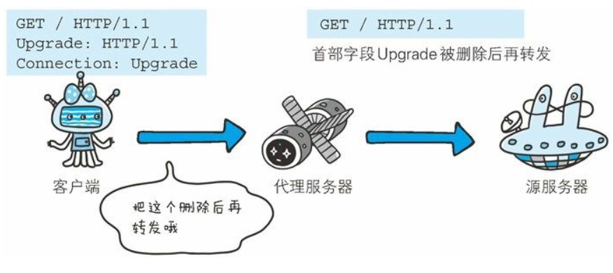

   ```http
   Connection:不再转发的首部字段名
   ```

   在客户端发送请求和服务器返回的响应内，使用Connection 首部字段，可控制不再转发给代理的首部字段（即Hop-by-hop首部）

2. **管理持久连接**

   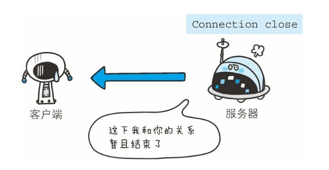

   ```http
   Connection:close
   ```

   HTTP/1.1 版本的默认连接都是持久连接。为此，客户端会在持久连接上连续发送请求。当服务器端明确断开连接时，则指定Connection首部字段的值为Close

   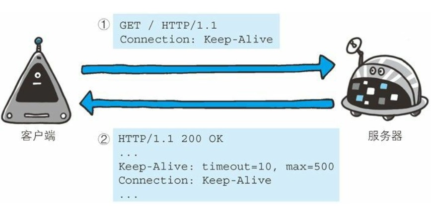

   ```http
   Connection:Keep-Alive
   ```

   HTTP/1.1之前的HTTP版本的默认连接都是非持久连接。为此，如果想在旧版本的HTTP、协议上维持持续连接，则需要指定Connection 首部字段的值为Keep-Alive


### 6.3.3Date

首部字段Date表明创建HTTP报文的日期和时间。

* RFC1123中规定的时间格式

  ```http
  Date:Tue,03 Jul 2020 04:40:59 GMT
  ```

* RFC850中规定的时间格式

  ```http
  Date:Tue, 03-Jul-12 04:40:59 GMT
  ```

* 还有一种格式。它与 C 标准库内的 asctime() 函数的输出 格式一致。

  ```http
  Data:Tue Jul 03 04:40:59 2012
  ```

### 6.3.4Pragma

pragma 是HTTP/1.1之前版本的历史遗留问题，仅作为与HTTP/1.0的向后兼容而定义

规范定义的形式唯一，如下所示、

```http
Pragma:no-cache
```

该首部字段属于通用首部字段，但只用在客户端发送的请求中。客户端回要求所有的中间服务器不返回缓存的资源。

所有的中间服务器如果都能以HTTP/1.1为基准，那直接采用Cache-Control:no-cache指定缓存的处理方式是最为理想的。

但要整体掌握全部中国南京爱你服务器使用的HTTP协议版本却是不现实的。因此，发送的请求会同时含有下面两个首部字段

```http
Cache-Control:no-cache
Pragme:no-cache
```


### 6.3.5Trailer

首部字段Trailer 会事先说明再报文主体后记录了那些首部字段。该首部字段可应该再HTTP/1.1 版本块传编码时。

```http
HTTP/1.1 200 OK
Date:Tue, 03 Hul 2012 04:40:56 GMT
Content-Type:text/html
...
Transfer-Encoding:chunked
Traile:Expires
...(报文主体)...
0
Expires:Tue,28 Sep 2004 23:59:59 GMT
```

以上用例中，指定首部字段Trailer的值为Expires，在报文主体之后（分块长度0之后）出现了首部字段Expires


### 6.3.6 Transfer-Encoding

首部字段Transfer-Encoding 规定了传输报文主体时采用的编码方式

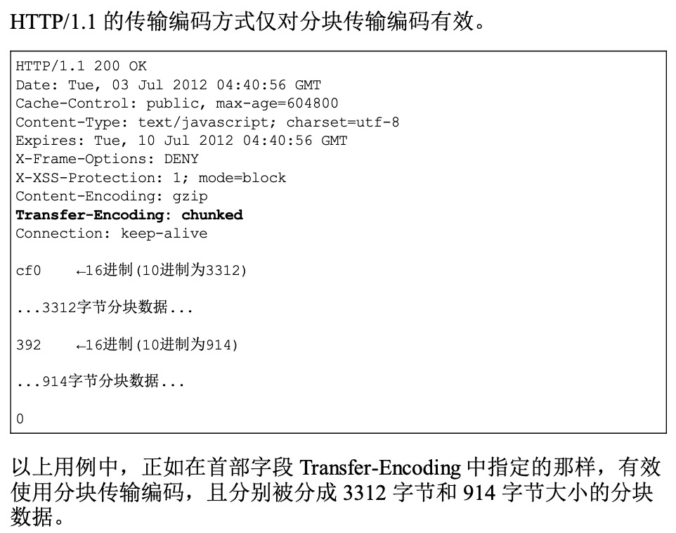

### 6.3.7Upgrade

首部字段Upgrade用于检测HTTP协议及其他协议是否可使用更高的版本进行通信，其参数值可以用来指定一个完全不同的通信协议

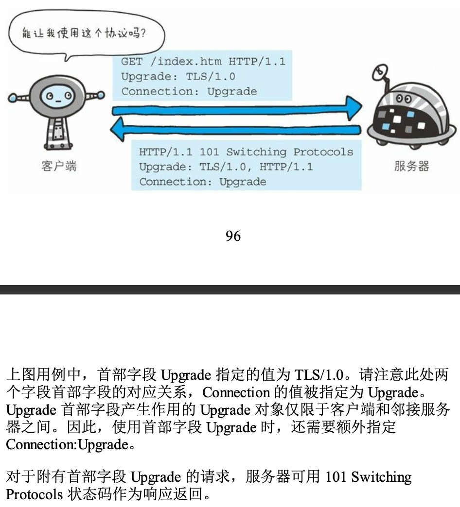

### 6.3.8Via

使用首部字段Via是为了追踪客户端与服务器之间的请求和响应报文的传输路径

报文经过代理或网关时，会先在首部字段Via中附加该服务器的信息，然后在进行转发。这个做法和traceroute 及电子邮件的Received 首部的工作机制很类似。

首部字段Via 不仅用于追踪报文的转发，还可避免请求会还的发生。所以必须在经过代理时附加该首部字段内容。

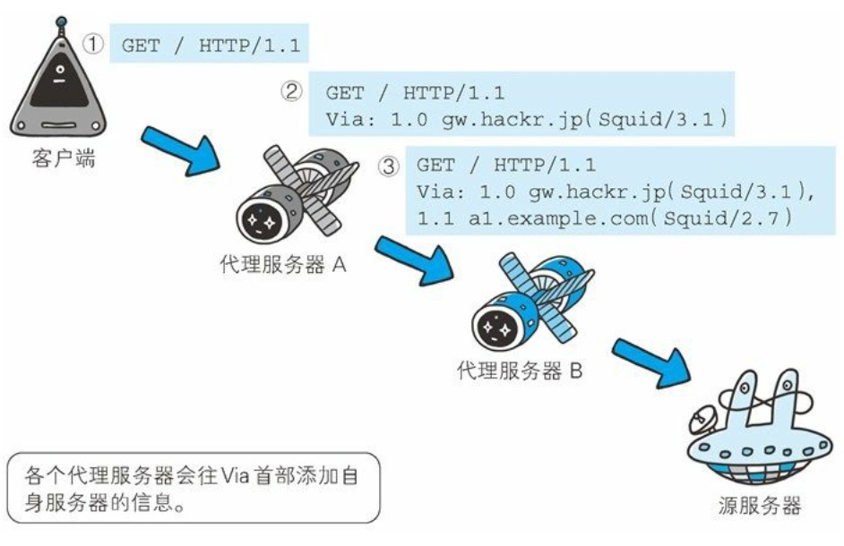

Via首部是为了追踪传输路径，所以经常会和TRACE方法一起使用。

### 6.3.9Warning

HTTP/1.1的Warning首部是从HTTP/1.0的响应首部（Retry-After）演变过来的

```http
Warning:113 gw.hackr.jp:8080 "Heuristic expiration" Tue,03
Warning:[警告码][警告的主机:端口号]"[警告内容]"([日期时间])
```

警告码列表

| 警告码 | 警告内容                                          | 说明                                                         |
| ------ | ------------------------------------------------- | ------------------------------------------------------------ |
| 110    | Response is stale（响应已过期）                   | 代理返回已过期的资源                                         |
| 111    | Revalidation failed （再验证失败）                | 代理再验证资源有效性时失败<br />（服务器无法到达的原因）     |
| 112    | Disconnection operation（断开链接操作）           | 代理与互联网连接被故意切段                                   |
| 113    | Heuristic expiration（试探性过期）                | 响应的使用期超过24小时（有效缓存的设定时间大于24小时的情况下） |
| 199    | Miscellaneous warning（杂项警告）                 | 任意的警告内容                                               |
| 214    | Transformation applied（使用了转换）              | 代理对某些内容编码或媒体类型执行了某些处理                   |
| 299    | Miscellaneous persistent warning （持久杂项警告） | 任意的警告内容                                               |


## 6.4请求首部字段

请求首部字段是从客户端往服务器端发送请求报文中所使用的字段，用于补充请求的附加信息，客户端信息，响应内容相关的优先级等内容。

### 6.4.1Accept


